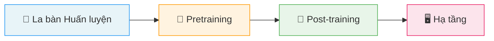

# Giới thiệu

> [!NOTE]
> 📖 **Bản dịch Tiếng Việt**
> Tài liệu này là bản dịch tiếng Việt của **"The Smol Training Playbook: The Secrets to Building World-Class LLMs"** được xuất bản bởi Hugging Face. Bản gốc tiếng Anh có tại [huggingface.co](https://huggingfacetb-smol-training-playbook.hf.space/). Các thuật ngữ kỹ thuật quan trọng được giữ nguyên tiếng Anh kèm giải thích tiếng Việt khi xuất hiện lần đầu.

> *Một hành trình thực tế xuyên suốt những thách thức, quyết định, và thực tế lộn xộn đằng sau việc huấn luyện các mô hình ngôn ngữ đạt đẳng cấp thế giới.*

### Tác giả

- [Loubna Ben Allal](https://huggingface.co/loubnabnl)
- [Lewis Tunstall](https://huggingface.co/lewtun)
- [Nouamane Tazi](https://huggingface.co/nouamanetazi)
- [Elie Bakouch](https://huggingface.co/eliebak)
- [Ed Beeching](https://huggingface.co/edbeeching)
- [Carlos Miguel Patiño](https://huggingface.co/cmpatino)
- [Clémentine Fourrier](https://huggingface.co/clefourrier)
- [Thibaud Frere](https://huggingface.co/tfrere)
- [Anton Lozhkov](https://huggingface.co/anton-l)
- [Colin Raffel](https://huggingface.co/craffel)
- [Leandro von Werra](https://huggingface.co/lvwerra)
- [Thomas Wolf](https://huggingface.co/thomwolf)

**Liên kết:** [Hugging Face](https://huggingface.co) · **Ngày xuất bản:** 30 tháng 10, 2025

---

## Thực sự cần gì để huấn luyện một LLM hiệu suất cao?

**Thời gian đọc:** 2–4 ngày.

Các nghiên cứu đã công bố khiến mọi thứ trông có vẻ đơn giản: lựa chọn kiến trúc chiến lược, tập dữ liệu được tuyển chọn cẩn thận, và đủ tài nguyên tính toán. Kết quả được trình bày bóng bẩy, các ablation (thí nghiệm loại bỏ từng thành phần để đánh giá tác động) được cấu trúc gọn gàng. Mọi quyết định đều có vẻ hiển nhiên khi nhìn lại. Nhưng những báo cáo đó chỉ cho thấy những gì đã thành công và áp dụng một chút hồi tưởng tích cực — chúng không nắm bắt được những phiên debug dataloader lúc 2 giờ sáng, những đợt tăng đột biến loss, hay lỗi tensor parallelism (song song hóa tensor) tinh vi âm thầm phá hoại quá trình huấn luyện. Thực tế lộn xộn hơn, lặp đi lặp lại hơn, và đầy những quyết định không bao giờ xuất hiện trong bài báo cuối cùng.

Hãy cùng chúng tôi nhìn vào hậu trường của việc huấn luyện [SmolLM3](https://huggingface.co/HuggingFaceTB/SmolLM3-3B), một **mô hình suy luận đa ngôn ngữ 3 tỷ tham số** được huấn luyện trên **11 nghìn tỷ (11T) token**. Đây không phải là một hướng dẫn bình thường, mà là sự gỡ rối của một mạng nhện các quyết định, khám phá, và ngõ cụt dẫn đến những hiểu biết sâu sắc về những gì cần thiết để xây dựng các mô hình ngôn ngữ đẳng cấp thế giới.

Đây cũng là **tác phẩm cuối cùng** trong chuỗi bài viết dài về huấn luyện mô hình của chúng tôi. Chúng tôi đã đi qua:

- **[FineWeb](https://huggingface.co/spaces/HuggingFaceFW/blogpost-fineweb-v1)** — Xây dựng tập dữ liệu ở quy mô lớn
- **[The Ultra-Scale Playbook](https://huggingface.co/spaces/nanotron/ultrascale-playbook)** — Điều phối hàng nghìn GPU hoạt động đồng bộ
- **[The LLM Evaluation Guidebook](https://github.com/huggingface/evaluation-guidebook)** — Lựa chọn phương pháp đánh giá tốt nhất ở mỗi bước

Giờ đây, chúng tôi kết hợp tất cả lại để xây dựng một mô hình AI mạnh mẽ. Chúng tôi sẽ dẫn bạn qua toàn bộ hành trình — không chỉ công thức cuối cùng đã hoạt động, mà còn cả những thất bại, sự cố hạ tầng, và quy trình debug đã định hình mọi quyết định. Bạn sẽ thấy:

- Cách những ablation quy mô nhỏ đầy hứa hẹn đôi khi không chuyển đổi được ở quy mô lớn
- Tại sao chúng tôi phải khởi động lại một lần huấn luyện sau 1T token
- Cách chúng tôi cân bằng các mục tiêu cạnh tranh giữa đa ngôn ngữ, toán học và lập trình trong khi duy trì hiệu suất tiếng Anh mạnh mẽ
- Và cuối cùng, cách chúng tôi post-train (huấn luyện giai đoạn sau) một mô hình suy luận lai

Chúng tôi đã cố gắng không chỉ liệt kê mọi thứ đã làm mà thay vào đó trình bày một câu chuyện có tổ chức về cuộc phiêu lưu của mình. Hãy nghĩ về tài liệu này như một hướng dẫn cho bất kỳ ai đang cố gắng đi từ *"chúng tôi có tập dữ liệu tuyệt vời và GPU"* đến *"chúng tôi đã xây dựng một mô hình thực sự mạnh."*

---

## Cách Đọc Hướng Dẫn Này

Bạn không cần đọc toàn bộ hướng dẫn từ đầu đến cuối — và ở thời điểm này, nó quá dài để đọc hết trong một lần. Nội dung được cấu trúc thành nhiều phần riêng biệt, bất kỳ phần nào cũng có thể bỏ qua hoặc đọc độc lập:

### 🧭 La bàn Huấn luyện (Training Compass)
Một cuộc thảo luận cấp cao về việc liệu bạn có nên pretrain (huấn luyện trước) mô hình của riêng mình hay không. Chúng tôi sẽ dẫn bạn qua những câu hỏi cơ bản cần tự hỏi trước khi đốt hết tiền đầu tư mạo hiểm, và cách suy nghĩ một cách hệ thống qua quy trình ra quyết định. Đây là phần chiến lược; nếu bạn muốn nhảy thẳng vào nội dung kỹ thuật, hoàn toàn ổn.

### 🔬 Pretraining (Huấn luyện trước)
Các phần sau la bàn huấn luyện bao gồm mọi thứ bạn cần biết để xây dựng một công thức vững chắc cho lần pretraining của riêng mình: cách chạy ablation, chọn phương pháp đánh giá, trộn nguồn dữ liệu, đưa ra lựa chọn kiến trúc, tinh chỉnh siêu tham số, và cuối cùng chịu đựng cuộc marathon huấn luyện. Phần này cũng phù hợp nếu bạn không định pretrain từ đầu mà quan tâm đến **continued pretraining** (huấn luyện tiếp tục, hay còn gọi là mid-training).

### 🎯 Post-training (Huấn luyện giai đoạn sau)
Trong phần này, bạn sẽ học tất cả các thủ thuật cần thiết để khai thác tối đa mô hình pretrained. Chúng tôi sẽ bao quát toàn bộ bảng chữ cái post-training, bắt đầu với **SFT** (Supervised Fine-Tuning — Tinh chỉnh có giám sát), **DPO** (Direct Preference Optimization — Tối ưu hóa sở thích trực tiếp), và **GRPO** (Group Relative Policy Optimization — Tối ưu hóa chính sách tương đối nhóm), cũng như nghệ thuật đen tối và giả kim của model merging (gộp mô hình).

### 🖥️ Hạ tầng (Infrastructure)
Nếu pretraining là chiếc bánh và post-training là lớp kem phủ và quả cherry trên cùng, thì hạ tầng là **chiếc lò công nghiệp**. Không có nó, không gì xảy ra, và nếu nó hỏng, buổi nướng bánh Chủ nhật vui vẻ của bạn biến thành mối nguy cháy nổ. Phần này đi qua bố cục GPU, mô hình giao tiếp giữa CPU/GPU/node/lưu trữ, và cách xác định cũng như khắc phục các điểm nghẽn.

---

Vậy chúng ta bắt đầu từ đâu? **Hãy chọn phần mà bạn thấy thú vị nhất và bắt đầu thôi!**

Nếu bạn có câu hỏi hoặc nhận xét, hãy mở một cuộc thảo luận trên [tab Cộng đồng](https://huggingface.co/spaces/HuggingFaceTB/smol-training-playbook/discussions)!
