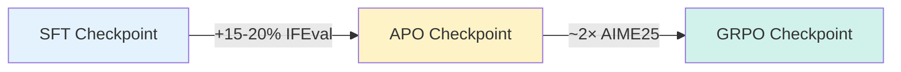
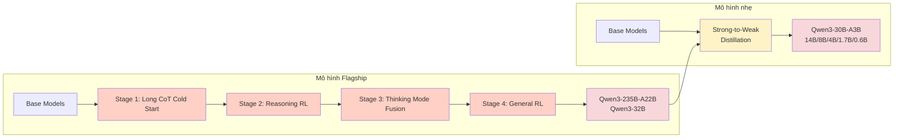
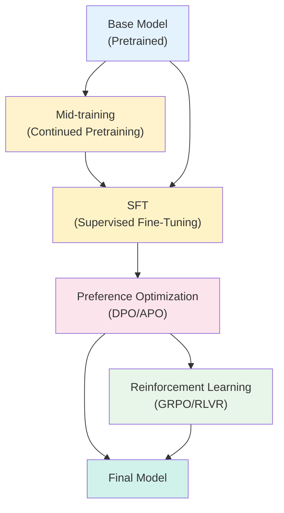

# GRPO và Học Tăng cường (Reinforcement Learning)

Group Relative Policy Optimization (GRPO — Tối ưu hóa Policy theo Nhóm Tương đối) là một trong những thuật toán RL hiệu quả nhất cho LLM hiện nay. Chương này khám phá GRPO cùng các phương pháp RL khác cho post-training.

## Vượt ra ngoài Nhãn Giám sát: Going Online

Nếu bạn muốn mô hình **nhất quán giải bài toán, sinh executable code, hoặc lên kế hoạch qua nhiều bước**, bạn thường cần một **reward signal** (tín hiệu thưởng) thay vì chỉ "A tốt hơn B."

Đây là nơi **Reinforcement Learning (RL — Học Tăng cường)** bắt đầu có ý nghĩa. Thay vì giám sát mô hình bằng preference, bạn cho nó tương tác với **environment** (môi trường) — có thể là math verifier, code executor, hoặc thậm chí phản hồi từ người dùng thực — và học trực tiếp từ kết quả.

**RL tỏa sáng khi:**

- Bạn có thể **kiểm tra tính đúng tự động** — bằng unit test, chứng minh toán học, hoặc API call — hoặc có verifier/reward model chất lượng cao
- Tác vụ đòi hỏi **suy luận hoặc lên kế hoạch nhiều bước**, nơi preference cục bộ không nắm bắt được thành công dài hạn
- Bạn muốn **tối ưu cho mục tiêu vượt xa preference label** — như pass unit test hoặc maximize objective nào đó

## Hai hương vị RL cho LLM

### RLHF (Reinforcement Learning from Human Feedback — Học Tăng cường từ Phản hồi Con người)

Cách tiếp cận này, phổ biến nhờ paper InstructGPT của OpenAI, là nền tảng cho GPT-3.5 và nhiều LLM hiện đại:

1. Annotator so sánh output mô hình ("A tốt hơn B")
2. **Reward model** được train để dự đoán preference đó
3. Policy (mô hình) được fine-tune bằng RL để maximize reward đã học

> [!WARNING]
> Vì reward model chỉ *xấp xỉ* preference con người, nó có thể khuyến khích **reward hacking** — mô hình phát ra chuỗi out-of-distribution như "the the the the" nhận reward giả cao và bị ghi vào mô hình qua RL loop.

### RLVR (Reinforcement Learning with Verifiable Rewards — Học Tăng cường với Reward Có thể Xác minh)

Cách tiếp cận này, phổ biến nhờ DeepSeek-R1, sử dụng **verifier** kiểm tra output mô hình theo tiêu chí đúng đắn rõ ràng:

- Code có compile và pass tất cả test không?
- Đáp án toán học có đúng không?

Policy sau đó được fine-tune bằng RL để sản xuất nhiều output đúng có thể xác minh hơn.

## Thuật toán GRPO

**GRPO (Group Relative Policy Optimization)** thuộc nhóm thuật toán **on-policy optimization** — mô hình (policy) sinh ra completion cũng chính là mô hình đang được tối ưu.

Tuy nhiên có vài điểm cần lưu ý:

- Để tối ưu bước generation, nhiều batch completion được sample, sau đó thực hiện $k$ lần update. Batch đầu tiên là on-policy, các batch tiếp theo **hơi off-policy**
- Để xử lý **policy lag** giữa mô hình dùng cho generation và mô hình đang optimization, sử dụng **importance sampling** và **clipping** để reweight xác suất token và hạn chế kích thước update
- Thường có ít hơn 16 step chênh lệch giữa mô hình generation và optimization

### Tăng tốc với Async Generation

Vì autoregressive generation từ LLM chậm, nhiều framework như [vERL](https://github.com/volcengine/verl) và [PipelineRL](https://github.com/ServiceNow/PipelineRL) đã thêm:

- **Asynchronous generation** completion
- **"In-flight" updates** trọng số mô hình

Những cải tiến này đạt tốc độ huấn luyện **4-5× nhanh hơn** phương pháp đồng bộ, đặc biệt hiệu quả cho reasoning model với phân phối token đuôi dài.

## Thiết kế Reward

Với SmolLM3, chúng tôi bỏ qua RL trong phiên bản phát hành (do hạn chế thời gian và mô hình đã best-in-class với offline preference optimization). Tuy nhiên, sau phát hành, chúng tôi đã quay lại chủ đề này.

### Áp dụng RLVR cho Hybrid Reasoning Model

Hybrid reasoning model tạo ra **sự phức tạp bổ sung** cho RLVR vì độ dài generation thay đổi đáng kể theo chế độ reasoning:

| Chế độ | Median Token Length (AIME25) | Phân phối |
|--------|------------------------------|-----------|
| `/no_think` | ~2k tokens | Tập trung |
| `/think` | ~16k tokens | Fat-tailed (đuôi béo) |

### Vấn đề Reward Hacking bất ngờ

Khi áp dụng GRPO một cách naively cho chế độ `/no_think`, điều bất ngờ xảy ra: mặc dù **không bao giờ được prompt để sinh chain of thought dài**, mô hình học cách khai thác khả năng reasoning base để tăng reward!

Không chỉ reward tăng, mà **độ dài completion cũng tăng** — RLVR với GRPO đã biến chế độ `/no_think` thành chế độ trông rất giống `/think`!

Khi review completion, mô hình sinh CoT dài và thậm chí bao gồm **cognitive behaviors** như "Wait, …" — đặc trưng của reasoning model:

```
However, since the jogger and the train are moving in the same direction,
the relative speed between them is the difference of their speeds:
v_rel = v_t - v_j = 12.7778 - 2.7778 = 10 m/s

**Wait,** let me double-check the calculation:
**Wait,** 46 km/hr to m/s: 46 * 1000 m / 3600 s = 460/36 ≈ 12.7778 m/s (correct)
...
**Wait** the problem says: "A jogger running at 10 km/hr alongside a railway
track is 340 m ahead of the engine..."
```

### Giảm thiểu Reward Hacking với Overlong Penalty

Vấn đề này được giảm thiểu bằng **overlong completion penalty** — phạt completion vượt độ dài nhất định. Penalty này là một trong những cải tiến từ paper DAPO và được tham số hóa bởi:

- $L_{max}$ — max completion length
- $L_{cache}$ — soft punishment cache

**Kết quả theo dải penalty:**

| Overlong Penalty | Reward | Độ dài completion | AIME25 |
|-----------------|--------|-------------------|--------|
| 1.5k | Cao | Ngắn (bị hạn chế) | Thấp |
| 2-2.5k | ✅ Tốt | Kiểm soát được | ✅ Cải thiện đáng kể |
| 3k | ✅ Tốt nhất | Tốt | ✅ Tốt nhất |
| 4k | Khá | Dài hơn | Khá |

> [!IMPORTANT]
> Length penalty trong dải **2.5-3k** cho trade-off tốt nhất giữa hiệu suất và độ dài phản hồi.

## Kết quả RL của SmolLM3

Khi kết hợp tất cả, GRPO **gần gấp đôi hiệu suất trên AIME 2025** so với phương pháp offline như APO:



### Thách thức Joint Training

Bước tiếp theo trong RL pipeline sẽ là **joint training** cả hai chế độ reasoning cùng lúc. Tuy nhiên, chúng tôi nhận thấy đây là bài toán **rất khó** vì:

- Mỗi chế độ yêu cầu length penalty riêng
- Sự tương tác giữa hai chế độ tạo ra huấn luyện không ổn định

> [!NOTE]
> Thách thức này phản ánh xu hướng mới từ các nhà phát triển mô hình như Qwen — phát hành biến thể **instruct** và **reasoning** riêng biệt.

## So sánh RL vs. KD vs. SFT

### RL có phải lựa chọn duy nhất?

Một số phương pháp on-policy nhẹ hơn đã được đề xuất:

| Phương pháp | Cách hoạt động | Ưu điểm | Nhược điểm |
|-------------|---------------|---------|------------|
| **GRPO/REINFORCE** | On-policy RL với verifiable rewards | Mạnh nhất cho reasoning | Phức tạp, tốn compute |
| **Online DPO** | Liên tục sinh response mới + preference label | Ít phức tạp hơn RL đầy đủ, match GRPO trên math | Cần reward model/grader |
| **On-policy Distillation** | Student sample responses, KL divergence (phân kỳ KL) với teacher logits | Hiệu quả compute nhất, vượt trội RL cho small model | Teacher và student phải cùng tokenizer |

### On-policy Distillation: Hiệu quả bất ngờ

Một tính chất thú vị của on-policy distillation với small model: nó thường **vượt trội RL-based methods với chi phí compute nhỏ hơn nhiều.** Thay vì sinh nhiều rollout per prompt, chỉ cần sample một — sau đó được teacher chấm điểm trong một forward/backward pass duy nhất.

Qwen3 tech report cho thấy distillation được sử dụng để huấn luyện mô hình dưới 32B:



### GOLD: Distillation không cùng Tokenizer

Một điểm yếu của tất cả phương pháp on-policy distillation: teacher và student phải **cùng tokenizer**. Để giải quyết, Hugging Face đã phát triển phương pháp mới: **General On-Policy Logit Distillation (GOLD)** — cho phép distill bất kỳ teacher nào vào bất kỳ student nào.

### Giảm thiểu Catastrophic Forgetting

[Thinking Machines](https://thinkingmachines.ai/blog/on-policy-distillation/) đã chứng minh on-policy distillation hiệu quả trong việc giảm thiểu **catastrophic forgetting** — khi mô hình post-trained được fine-tune thêm trên domain mới và hiệu suất trước đó bị thoái lui.

## Nên chọn phương pháp nào?

Mặc dù có rất nhiều paper nghiên cứu về phương pháp on-policy "tốt nhất," trong thực tế quyết định phụ thuộc vào:

| Yếu tố | GRPO/RL | Online DPO | On-policy Distillation |
|---------|---------|------------|----------------------|
| Có verifier tốt? | ✅ Lý tưởng | Không cần | Không cần |
| Compute budget | Nhiều | Trung bình | Ít nhất |
| Mô hình nhỏ (&lt;32B)? | Được | Được | ✅ Tốt nhất |
| Cần teacher mạnh? | Không | Không bắt buộc | ✅ Cần |
| Độ phức tạp implement | Cao | Trung bình | Thấp |

## Tổng kết Post-Training



Nếu bạn đã đọc đến đây, xin chúc mừng: bạn giờ có **tất cả thành phần cốt lõi** cần thiết cho thành công với post-training. Bạn đã sẵn sàng chạy thí nghiệm và kiểm thử các thuật toán khác nhau để đạt kết quả SOTA.

> [!TIP]
> Nhìn chung, vẫn còn nhiều việc phải làm với cả **scaling RL hiệu quả** và **khám phá phương pháp khác cho hiệu quả tính toán**. Thời đại thú vị thực sự!
