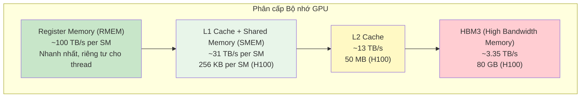
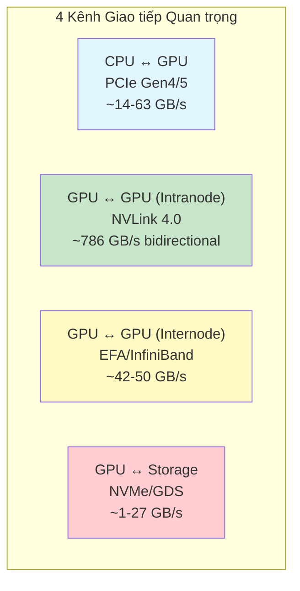
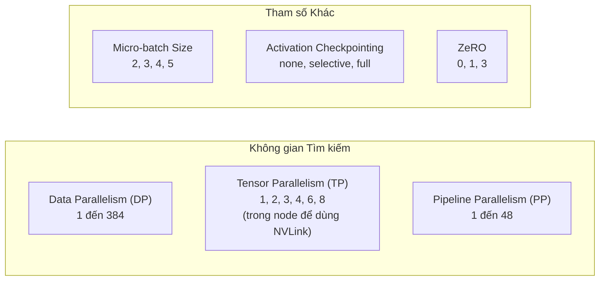
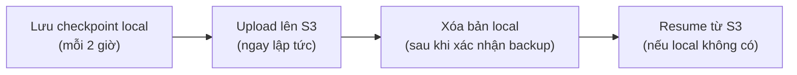
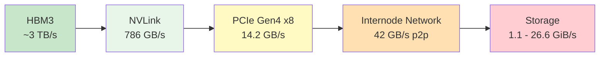

# Hạ tầng: GPU, Cluster và Debugging

Bạn đã biết mọi thứ về kiến trúc mô hình, dữ liệu và huấn luyện. Bây giờ hãy đến với thành phần then chốt nhưng thường bị đánh giá thấp: **hạ tầng** (infrastructure). Dù bạn tập trung vào framework, kiến trúc hay curation dữ liệu, việc hiểu cơ bản về hạ tầng giúp bạn **xác định bottleneck** (điểm nghẽn), tối ưu chiến lược parallelism, và debug các vấn đề throughput.

Hầu hết mọi người khi huấn luyện mô hình đều rất quan tâm đến kiến trúc và dữ liệu, nhưng ít người hiểu chi tiết hạ tầng. SmolLM3 được huấn luyện trên **384 GPU H100** trong gần một tháng, xử lý tổng cộng **11 nghìn tỷ token** — và đây *không phải* một hành trình suôn sẻ! Trong thời gian đó, đội ngũ phải đối mặt với lỗi node, vấn đề storage, và khởi động lại nhiều lần.

> **Tên của cuộc chơi trong chương này là: Tìm và sửa các bottleneck!**

## Bên trong GPU: Kiến trúc Nội bộ

GPU về cơ bản là bộ xử lý **song song quy mô lớn** (massively parallel processor), được tối ưu cho **throughput** (thông lượng) hơn **latency** (độ trễ). Không giống CPU vốn xuất sắc trong việc thực thi nhanh một vài luồng lệnh phức tạp, GPU đạt hiệu suất bằng cách thực thi hàng nghìn phép toán đơn giản đồng thời.

Ở mức cao nhất, GPU thực hiện hai nhiệm vụ thiết yếu:

1. **Di chuyển và lưu trữ dữ liệu** (hệ thống bộ nhớ)
2. **Thực hiện tính toán hữu ích** (pipeline tính toán)

### Đơn vị Tính toán và FLOPs

:::info TL;DR
GPU đo hiệu suất bằng **FLOPs** (floating-point operations per second — phép toán dấu phẩy động mỗi giây). GPU hiện đại như H100 cho throughput cao hơn đáng kể ở precision thấp hơn: **990 TFLOPs ở BF16** so với **67 TFLOPs ở FP32**. Tuy nhiên, hiệu suất thực tế đạt 70–77% peak lý thuyết do bottleneck bộ nhớ. Training SOTA đạt 20–41% hiệu suất end-to-end, còn gọi là **MFU** (Model FLOPs Utilization — Tỷ lệ sử dụng FLOPs mô hình).
:::

**FLOP** (Floating-Point Operation) là một phép toán số học đơn lẻ, ví dụ `a + b`. GPU hiện đại có thể thực thi hàng nghìn tỷ phép này mỗi giây (TFLOPs).

Các khối xây dựng cơ bản của GPU compute là **Streaming Multiprocessors (SMs)** — các đơn vị xử lý độc lập thực thi lệnh song song. Mỗi SM chứa hai loại core:

- **CUDA Cores**: Cho phép toán dấu phẩy động tiêu chuẩn
- **Tensor Cores**: Chuyên biệt cho phép nhân ma trận — phép toán chủ lực trong deep learning

GPU H100 SXM5 chứa **132 SMs**. Mỗi SM thực thi nhóm 32 thread gọi là **warp** theo kiểu lockstep. Mô hình thực thi **SIMT** (Single Instruction, Multiple Threads) này có nghĩa tất cả thread trong một warp thực thi cùng một lệnh đồng thời trên dữ liệu khác nhau.

#### Precision quan trọng

**Tensor Cores** có thể hoạt động ở các precision khác nhau (FP64, FP32, FP16/BF16, FP8, FP4). Throughput đạt được thay đổi đáng kể — thường theo bậc lớn — tùy thuộc data type:

| GPU | FP64 | FP32 (TF32) | BF16 | FP8 | FP4 |
|-----|------|-------------|------|-----|-----|
| **A100** | 19.5 | 156 | 312 | — | — |
| **H100** | 67 | ~495 | 990 | 3,960 | — |
| **B200** | — | — | 2,250 | 4,500 | 10,000 |

*Đơn vị: TFLOPs. Nguồn: NVIDIA, SemiAnalysis*

#### Hiệu suất Thực tế vs. Lý thuyết

Đội ngũ SmolLM3 sử dụng [SemiAnalysis GEMM benchmark](https://newsletter.semianalysis.com/p/mi300x-vs-h100-vs-h200-benchmark-part-1-training) để kiểm tra H100 với các hình dạng ma trận thực tế từ Llama 70B:

- **FP64**: Đạt 49–56 TFLOPs (74–84% peak lý thuyết 67 TFLOPs)
- **TF32**: Đạt 356–396 TFLOPs (72–80% peak ~495 TFLOPs dense)
- **BF16**: Đạt **714–758 TFLOPs** (72–77% peak 990 TFLOPs) — tỷ lệ sử dụng xuất sắc!
- **FP8**: Đạt 1,210–1,457 TFLOPs (31–37% peak 3,960 TFLOPs) — thấp hơn vì **memory-bound**

**MFU (Model FLOPs Utilization)** trong training thực tế:
- Meta đạt **38–41%** khi train Llama 3 405B
- DeepSeek-V3 đạt **~20–30%** (bottleneck communication do kiến trúc MoE)
- SmolLM3 đạt **~30% MFU** trên 384 H100s

> ⚠️ **Bài học quan trọng**: Luôn dùng **con số thực tế**, không phải marketing specs, khi lập kế hoạch training runs.

### Phân cấp Bộ nhớ GPU: Từ Registers đến HBM

:::info TL;DR
GPU tổ chức bộ nhớ theo phân cấp từ nhanh nhưng nhỏ (registers, shared memory) đến chậm nhưng lớn (HBM main memory). AI hiện đại thường **memory-bound**: bottleneck là di chuyển dữ liệu, không phải tính toán. **Operator fusion** (như Flash Attention) đạt speedup 2–4× bằng cách giữ kết quả trung gian trong bộ nhớ on-chip nhanh.
:::



Phân cấp này tồn tại vì **SRAM** (dùng cho cache và registers) nhanh nhưng lớn và đắt, trong khi **DRAM** (dùng cho HBM) dày đặc và rẻ nhưng chậm hơn. Kết quả: Bộ nhớ nhanh có số lượng nhỏ gần compute unit, được hỗ trợ bởi các pool lớn hơn của bộ nhớ chậm hơn ở xa hơn.

#### Tại sao điều này quan trọng: Operator Fusion

Như [Horace He](https://horace.io/brrr_intro.html) giải thích: `load from memory → nhân đôi → ghi vào memory` tốn gần như **cùng thời gian** với `load from memory → nhân ba → ghi vào memory`. Tính toán gần như "miễn phí" so với truy cập bộ nhớ.

Đây là lý do **operator fusion** mạnh mẽ đến vậy. **Flash Attention** là ví dụ hoàn hảo:

- Attention tiêu chuẩn: Materialized toàn bộ ma trận attention $N \times N$ trong HBM — 3 lần đọc/ghi HBM
- Flash Attention: Xử lý theo **tiles** nằm vừa trong SRAM, kết quả trung gian **không bao giờ rời** bộ nhớ on-chip nhanh

Kết quả: Flash Attention giảm truy cập HBM từ $O(N^2)$ xuống $O(N)$, biến phép toán memory-bound thành phép toán tận dụng tốt hơn khả năng compute của GPU.

#### Roofline Model

**Roofline model** cung cấp framework trực quan để hiểu kernel của bạn là **compute-bound** hay **memory-bound**:

- **Memory-bound** (hầu hết thời gian di chuyển dữ liệu): Tăng compute throughput không giúp gì — cần giảm memory traffic qua operator fusion
- **Compute-bound** (hầu hết thời gian tính toán): Tối ưu memory access không giúp gì — cần thuật toán tốt hơn hoặc nhiều compute power hơn

## Giao tiếp Bên ngoài GPU

GPU không hoạt động cô lập. Trước khi bất kỳ tính toán nào xảy ra, dữ liệu phải được load vào bộ nhớ GPU. CPU cần lập lịch kernel và điều phối công việc. Trong distributed training, GPU phải liên tục trao đổi activation, gradient, và model weights.



### Giao tiếp CPU ↔ GPU

Tốc độ giao tiếp CPU–GPU phụ thuộc vào ba yếu tố:

1. **Compute capability** — khả năng tính toán của GPU
2. **Data transfer speed** — tốc độ di chuyển dữ liệu giữa bộ nhớ CPU và GPU
3. **Synchronization overhead** — chi phí đồng bộ CPU–GPU

Trên cluster P5 với H100, topology PCIe có hai hop:
- **CPU → PCIe switch**: PCIe Gen4 x8 (**15.75 GB/s**) — đây là **bottleneck**!
- **PCIe switch → GPU**: PCIe Gen5 x16 (**63.02 GB/s**)

```
$ ./nvbandwidth -t host_to_device_memcpy_ce -b <message_size> -i 5
```

Kết quả: Với message size lớn, đạt **~14.2 GB/s** — khoảng 90% bandwidth lý thuyết 15.754 GB/s. Latency khoảng **1.4 μs** cho CPU–GPU round-trip.

#### NUMA Affinity

Trên hệ thống multi-socket (ví dụ AMD EPYC 7R13, 2 socket, 48 core mỗi socket), **NUMA affinity** cực kỳ quan trọng. Khoảng cách NUMA:

```
$ numactl --hardware
node distances:
  node   0   1
    0:  10  32
    1:  32  10
```

Truy cập memory trên cùng NUMA node (distance 10) nhanh hơn **3.2×** so với cross-NUMA (distance 32).

### Giao tiếp GPU ↔ GPU Trong Node (Intranode)

:::info TL;DR
GPU trong một node có thể giao tiếp theo 3 cách: qua CPU (chậm nhất, ~3 GB/s), qua GPUDirect RDMA trên EFA NICs (~38 GB/s), hoặc qua NVLink (~786 GB/s bidirectional). NVLink nhanh hơn 9–112×.
:::

#### Qua CPU (Shared Memory)

Cách naive nhất: Dữ liệu từ GPU1 → PCIe switch → CPU → host memory → CPU → PCIe switch → GPU2. Bottleneck tại PCIe Gen4 x8 ~16 GB/s.

```bash
# Kích hoạt mode SHM (KHÔNG khuyến nghị)
NCCL_P2P_DISABLE=1 FI_PROVIDER=tcp
# Xác nhận:
NCCL INFO Channel 00 : 1[1] -> 0[0] via SHM/direct/direct
```

#### Qua GPUDirect RDMA trên EFA

**GPUDirect RDMA** (Remote Direct Memory Access) cho phép giao tiếp trực tiếp giữa GPU bằng cách truy cập trực tiếp bộ nhớ GPU, loại bỏ việc dữ liệu phải đi qua CPU. Mỗi GPU trên P5 có 4 EFA (Elastic Fabric Adapter) NIC, mỗi link 100 Gbps → tổng **3,200 Gbps (400 GB/s)** mỗi node.

```bash
# Kích hoạt GPUDirect RDMA qua EFA
FI_PROVIDER=efa NCCL_P2P_DISABLE=1
# Xác nhận:
NCCL INFO Channel 01/1 : 1[1] -> 0[0] [receive] via NET/Libfabric/0/GDRDMA/Shared
```

#### Qua NVLink

**NVLink** là công nghệ interconnect GPU-to-GPU tốc độ cao của NVIDIA. H100 sử dụng NVLink 4.0, cung cấp **900 GB/s bandwidth bidirectional** qua 18 link.

```bash
# Xác nhận NVLink đang được sử dụng
NCCL_DEBUG=INFO
NCCL INFO Channel 00/1 : 0[0] -> 1[1] via P2P/CUMEM
```

**Kết quả benchmark thực tế:**

| Phương thức | Send/Recv (GB/s) | Tốc độ tương đối |
|-------------|-------------------|-------------------|
| Qua CPU (SHM) | 3.24 | 1× (baseline) |
| GPUDirect RDMA/EFA | 38.16 | 9× |
| **NVLink** | **364.93** | **112.6×** |

Bandwidth bidirectional đo được: **786 GB/s** — đạt 85% spec lý thuyết 900 GB/s.

**NVLink SHARP (NVLS)** cung cấp collective operations được tăng tốc phần cứng, đẩy all-reduce lên **480 GB/s** (vượt bandwidth unidirectional lý thuyết 450 GB/s nhờ tăng tốc phần cứng trên NVSwitch).

### Giao tiếp GPU ↔ GPU Giữa các Node (Internode)

:::info TL;DR
Giao tiếp multi-node sử dụng mạng tốc độ cao như InfiniBand (400 Gbps) hoặc RoCE (100 Gbps). All-reduce scale tốt (320–350 GB/s, ổn định qua các node). All-to-all suy giảm mạnh hơn. Latency nhảy từ ~13 μs intranode lên 55 μs+ internode.
:::

Ba công nghệ mạng chính:

1. **Ethernet**: Đã phát triển từ 1 Gbps lên 100+ Gbps
2. **RoCE** (RDMA over Converged Ethernet): Mang khả năng RDMA lên mạng Ethernet
3. **InfiniBand**: Switch fabric của NVIDIA, lên đến 400 Gbps với sub-microsecond latency

**Bandwidth Analysis:**

| Operation | 1 node | 2 nodes | 3-16 nodes |
|-----------|--------|---------|------------|
| All-reduce | 480 GB/s | 479 GB/s | 320–350 GB/s |
| All-to-all | 344 GB/s | 81 GB/s | 45–58 GB/s |
| Send/Recv | — | 42–43 GB/s | 21–43 GB/s |

All-reduce cho thấy **scaling gần như hằng số** sau 2 node — rất khích lệ cho large-scale training! Đặc tính này cho phép các cluster training frontier hoạt động thường xuyên với 100,000+ GPU.

### Giao tiếp GPU ↔ Storage

:::info TL;DR
GPUDirect Storage (GDS) cho phép transfer trực tiếp GPU-to-storage, bypass CPU. Local NVMe RAID (8 × 3.5 TB ổ, RAID 0) cho **26.59 GiB/s** và **337k IOPS** — nhanh hơn 6.3× so với network storage.
:::

| Storage | Throughput | IOPS | Ghi chú |
|---------|-----------|------|---------|
| `/scratch` (NVMe RAID) | **26.59 GiB/s** | **337k** | Tốt nhất cho checkpoints |
| `/fsx` (WekaFS) | 4.21 GiB/s | 51k | Tốt cho shared data |
| `/admin` (FSx Lustre) | 1.13 GiB/s | 17k | Metadata-intensive OK |
| `/root` (EBS) | ~1.1 GiB/s | 730 | Chỉ cho sequential operations |

## Chiến lược Song song hóa (Parallelism)

### Có bao nhiêu GPU là đủ?

Công thức cơ bản:

$$\text{Số GPU} = \frac{\text{Tổng FLOPs cần thiết}}{\text{Throughput mỗi GPU} \times \text{Thời gian target}}$$

Cho SmolLM3:
- Model size: 3B parameters
- Training tokens: 11T tokens
- Target time: ~4 tuần
- Expected MFU: 30%

Tổng FLOPs = $6 \times N \times T = 6 \times 3\text{B} \times 11\text{T} \approx 2 \times 10^{23}$ FLOPs

Kết quả: Cần **375–400 H100s** → đội ngũ bảo đảm **384 GPU**.

### Amdahl's Law: Thêm GPU Không Phải Lúc Nào Cũng Tốt

**Amdahl's law** (Định luật Amdahl) nói rằng speedup từ parallelization bị giới hạn bởi phần serial (không thể song song hóa) của workload:

$$S_{\text{max}} = \frac{1}{(1-p) + \frac{p}{N}}$$

Nếu communication chiếm 10% mỗi training step, dù thêm bao nhiêu GPU, bạn sẽ **không bao giờ** đạt hơn 10× speedup. Thêm GPU thì communication fraction thường *tăng lên*.

### Tìm Cấu hình Parallelism Tối ưu

SmolLM3 sử dụng ba chiều parallelism chính:



**Cấu hình cuối cùng của SmolLM3:**

| Tham số | Giá trị | Lý do |
|---------|---------|-------|
| **DP** | 192 | Sử dụng EFA bandwidth cho gradient sync |
| **TP** | 2 | Trong node, tận dụng NVLink |
| **PP** | 1 | PP cho hiệu suất kém với model 3B nhỏ |
| **MBS** | 3 | Cân bằng memory và compute efficiency |
| **ZeRO** | 0 | Communication overhead của ZeRO-1/3 quá lớn |
| **GBS** | ~2.3M tokens | 192 × 3 × 1 × 4,096 |

> Nhiều quyết định parallelism bị ảnh hưởng bởi trạng thái thư viện tại thời điểm thí nghiệm. Ví dụ, Nanotron chưa hỗ trợ ZeRO-3, và không có PP schedule tối ưu.

## Xây dựng Hệ thống Training Bền vững

### Giám sát và Thay thế Node

Vì LLM training chạy hàng tuần đến hàng tháng, việc **theo dõi GPU health theo thời gian** là cực kỳ quan trọng.

**Công cụ chẩn đoán:**
- **[GPU Fryer](https://github.com/huggingface/gpu-fryer)**: Tool nội bộ stress-test GPU cho thermal throttling, memory errors
- **[NVIDIA DCGM Diagnostics](https://docs.nvidia.com/datacenter/dcgm/latest/user-guide/dcgm-diagnostics.html)**: Validate hardware, monitor performance

```
$ dcgmi diag -r 2 -v -d VERB
+---------------------------+-------------------------------------------+
| Diagnostic                | Result                                    |
+===========================+===========================================+
| PCIe                      | Pass - All                                |
| GPU Memory                | Pass - All                                |
| ...                       | ...                                       |
+---------------------------+-------------------------------------------+
```

**Thermal Throttling**: Theo dõi metric `DCGM_FI_DEV_CLOCK_THROTTLE_REASONS`. Trong quá trình test, một node bị throttling đã khiến all-reduce bandwidth **sụp từ 350 GB/s xuống 100 GB/s** — trong distributed training, bạn chỉ nhanh bằng node chậm nhất!

### Quản lý Checkpoint

Checkpoint là **lưới an toàn** trong training dài hạn. SmolLM3 lưu checkpoint mỗi 2 giờ:



**Bài học đau đớn**: Trong lần training StarCoder-15B, toàn bộ thư mục checkpoint bị xóa bởi lệnh `rm -rf $CHECKPOINT_PATH` còn sót lại trong script! May mắn có checkpoint ngày hôm trước, chỉ mất 1 ngày retrain. **Bài học**: Không bao giờ để lệnh hủy diệt trong production scripts.

Trên Slurm, dùng `SBATCH --requeue` để job tự động restart từ checkpoint mới nhất.

### Đánh giá Tự động

SmolLM3 sử dụng **[LightEval](https://github.com/huggingface/lighteval)** để chạy evaluation trên mọi checkpoint Nanotron đã lưu. Kết quả được push trực tiếp lên Weights & Biases hoặc [Trackio](https://github.com/gradio-app/trackio).

> 💡 Nếu bạn chỉ có thể tự động hóa **một thứ** trong setup training, hãy **tự động hóa evaluations**.

## Debugging GPU: Các Vấn đề Thường gặp

### Troubleshooting Interconnect

Nếu bandwidth thấp hơn kỳ vọng, kiểm tra hệ thống theo các lĩnh vực sau:

| Vấn đề | Giải pháp |
|--------|-----------|
| **Library versions cũ** | Cập nhật NCCL, EFA, CUDA. Log versions cho experiments quan trọng |
| **CPU Affinity sai** | Mỗi GPU nên được bind vào CPU cùng NUMA node. Dùng `NCCL_IGNORE_CPU_AFFINITY=1` |
| **Network topology** | Dùng Instance Topology API để kiểm tra placement. Instances cùng network node = latency thấp nhất |
| **Environment variables thiếu** | Xem [AWS EFA cheatsheet](https://github.com/aws-samples/awsome-distributed-training/blob/main/1.architectures/efa-cheatsheet.md) |

### Container (Docker) Considerations

Khi dùng container, cần lưu ý:

```bash
# Shared và pinned memory
docker run --shm-size=1g --ulimit memlock=-1 ...

# NUMA support
docker run --cap-add SYS_NICE ...

# PCI topology discovery — đảm bảo /sys được mount đúng
```

### Profiling và Xác định Bottleneck

Sử dụng **NVIDIA Nsight Compute** để profile kernel:

```bash
# Profile kernel với memory workload analysis
ncu --set full --kernel-name "your_kernel_name" \
    --launch-skip 0 --launch-count 1 python your_script.py
```

**Memory Chart** từ Nsight Compute cho thấy cách dữ liệu di chuyển giữa các đơn vị memory, với màu sắc chỉ ra phần trăm peak utilization.

## Tổng kết Bandwidth

Bảng tổng hợp tất cả bandwidth đã đo:



> **Insight chính**: Bandwidth giảm **đáng kể** khi di chuyển xa GPU hơn. Tuy nhiên, hệ thống training hiện đại có thể **overlap computation với communication**, ẩn chi phí communication sau compute operations.

Với hiểu biết về toàn bộ stack phần cứng này, bạn đã sẵn sàng để xác định bottleneck trong pipeline training của mình và tối ưu cho throughput tối đa!
