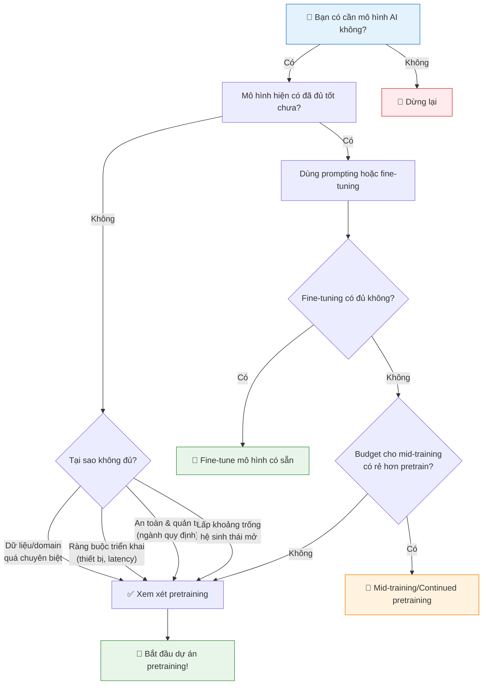
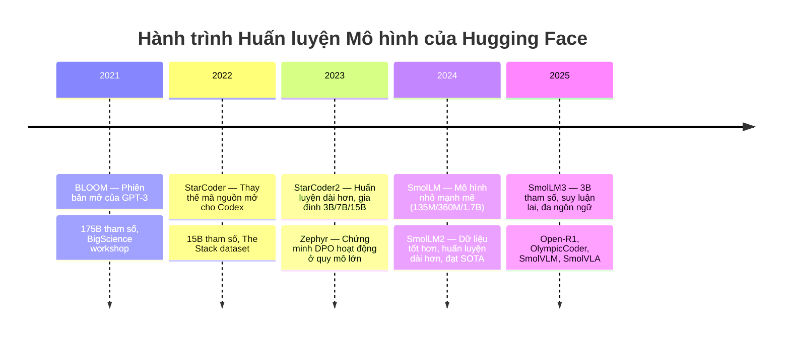

# La bàn Huấn luyện: Tại sao → Cái gì → Như thế nào

Lĩnh vực machine learning (học máy) có một mối quan hệ ám ảnh với tối ưu hóa. Chúng ta bị cuốn vào loss curve (đường cong mất mát), kiến trúc mô hình, và throughput (thông lượng); xét cho cùng, machine learning về cơ bản là tối ưu hóa hàm loss (hàm mất mát) của một mô hình. Tuy nhiên, trước khi lao vào các chi tiết kỹ thuật, có một câu hỏi cơ bản hơn thường không được đặt ra: **Liệu chúng ta có nên huấn luyện mô hình này không?**

Như heatmap (bản đồ nhiệt) sau cho thấy, hệ sinh thái AI nguồn mở phát hành các mô hình đẳng cấp thế giới gần như hàng ngày: Qwen, Gemma, DeepSeek, Kimi, Llama 🪦, OLMo — danh sách ngày càng dài hơn mỗi tháng. Đây không chỉ là những nguyên mẫu nghiên cứu hay ví dụ đồ chơi: Chúng là các mô hình cấp sản xuất bao phủ một phạm vi rộng đáng kinh ngạc các trường hợp sử dụng, từ hiểu đa ngôn ngữ đến sinh mã và suy luận.

Điều này dẫn đến một điểm khó chịu: **Có thể bạn không cần huấn luyện mô hình của riêng mình.**

Đây có vẻ là một cách kỳ lạ để bắt đầu một "hướng dẫn huấn luyện LLM." Nhưng nhiều dự án huấn luyện thất bại không phải vì siêu tham số tồi hay mã lỗi; chúng thất bại vì ai đó đã quyết định huấn luyện một mô hình mà họ không cần. Vì vậy, trước khi cam kết huấn luyện, bạn cần trả lời hai câu hỏi: **Tại sao bạn huấn luyện mô hình này? Bạn nên huấn luyện mô hình gì?** Nếu không có câu trả lời rõ ràng, bạn có thể lãng phí nhiều tháng tính toán và thời gian kỹ thuật để xây dựng thứ mà thế giới đã có, hoặc tệ hơn, thứ không ai cần.

> [!TIP]
> 💡 **Mẹo**
> Phần này khác với phần còn lại của hướng dẫn: ít về thí nghiệm và chi tiết kỹ thuật hơn, nhiều về lập kế hoạch chiến lược hơn. Nếu bạn đã suy nghĩ kỹ về "tại sao" và "cái gì", hãy nhảy sang phần [Ablation & Baseline](./ablation_baseline.md) để đi sâu vào kỹ thuật.

---

## Tại sao: Câu Hỏi Không Ai Muốn Trả Lời

Hãy thẳng thắn về những gì xảy ra trong thực tế. Ai đó (nếu may mắn) được truy cập vào một cụm GPU, có thể thông qua tài trợ nghiên cứu, có thể thông qua sức mạnh tính toán dư thừa của công ty, và quá trình suy nghĩ diễn ra đại khái như sau: *"Chúng ta có 100 H100 trong ba tháng. Hãy huấn luyện một mô hình!"* Kích thước mô hình được chọn tùy tiện, tập dữ liệu được tập hợp từ bất cứ thứ gì có sẵn. Huấn luyện bắt đầu. Và sáu tháng sau, sau khi đốt hết ngân sách tính toán và tinh thần nhóm, mô hình kết quả ngồi không sử dụng vì không ai từng hỏi *tại sao*.

### Lưu đồ quyết định

Lưu đồ sau hướng dẫn quá trình tư duy mà bạn nên đi qua trước khi bắt đầu một dự án pretraining (huấn luyện trước) lớn:

> [!NOTE]
> 📝 **Ghi chú**
> "Tại sao" ở đây là về huấn luyện từ đầu. Chúng tôi không đề cập đến distillation (chưng cất) hay pruning (cắt tỉa) trong hướng dẫn này. Đây là những con đường hợp lệ đến mô hình hiệu quả nhưng đại diện cho quy trình làm việc khác. Xem bài báo [Minitron](https://arxiv.org/abs/2408.11796) của NVIDIA để tổng quan.

---

## Ba Lĩnh Vực Mà Pretraining Tùy Chỉnh Có Ý Nghĩa

### 1. 🔬 Nghiên cứu: Bạn Muốn Hiểu Điều Gì?

Có rất nhiều nghiên cứu có thể làm trong không gian LLM. Điểm chung là bạn thường bắt đầu với một câu hỏi được định nghĩa rõ ràng:

- *Liệu chúng ta có thể scale training trên optimizer mới này lên mô hình 10B+ tham số?* — Xem ["Muon is Scalable for LLM Training"](https://huggingface.co/papers/2502.16982)
- *Liệu reinforcement learning (học tăng cường) một mình, không có SFT, có thể tạo ra khả năng suy luận?* — Xem ["DeepSeek-R1"](https://huggingface.co/papers/2501.12948)
- *Liệu chúng ta có thể huấn luyện mô hình nhỏ tốt chỉ trên dữ liệu sách giáo khoa tổng hợp?* — Xem ["Textbooks Are All You Need"](https://huggingface.co/papers/2306.11644)

Làm cho giả thuyết càng cụ thể càng tốt và suy nghĩ về quy mô thí nghiệm cần thiết sẽ tăng cơ hội thành công.

### 2. 🏭 Sản xuất: Tại Sao Không Thể Dùng Mô Hình Có Sẵn?

Có ba lý do chính khiến các công ty không thể sử dụng mô hình sẵn có:

| Lý do | Ví dụ |
|-------|-------|
| **Tính chuyên biệt domain** | Mô hình DNA với từ vựng và phụ thuộc tầm xa độc đáo; mô hình pháp lý/tài chính |
| **Ràng buộc triển khai** | LLM chạy trên drone; hệ thống on-prem với phần cứng tùy chỉnh (FPGA) |
| **An toàn và quản trị** | Kiểm soát hoàn toàn dữ liệu huấn luyện; ngành quy định; chứng minh cho cơ quan quản lý |

> 💡 **Bài test đơn giản:** Dành vài ngày xây dựng trên Qwen3, Gemma 3, hoặc mô hình SOTA khác. Bạn có thể đạt mục tiêu hiệu suất thông qua prompting, tool use, hoặc post-training không? Nếu không, có lẽ đã đến lúc huấn luyện mô hình riêng.

> [!WARNING]
> ⚠️ **Cảnh báo**
> Ngay cả khi ngân sách post-training cần thiết để đáp ứng yêu cầu là rất lớn, nó vẫn có thể rẻ hơn so với bắt đầu từ đầu. Fine-tuning mô hình trên 1T token tiết kiệm hơn so với huấn luyện từ đầu 10T+ token.

### 3. 🌐 Nguồn Mở Chiến Lược: Bạn Có Thấy Khoảng Trống Để Lấp Đầy?

Một trong những lý do phổ biến nhất mà các lab AI có kinh nghiệm phát hành mô hình mở là họ đã xác định được **khoảng trống cụ thể** trong hệ sinh thái nguồn mở.

Mẫu hình thường là: Bạn nhận thấy một lĩnh vực chưa được khám phá — có thể không có mô hình on-device mạnh với context rất dài, hoặc mô hình đa ngôn ngữ tồn tại nhưng yếu trên ngôn ngữ ít tài nguyên. Mục tiêu của bạn cụ thể: không phải "mô hình tốt nhất từ trước đến nay," mà là *"mô hình 3B tốt nhất cho sử dụng on-device"* hoặc *"mô hình nhỏ đầu tiên với cửa sổ context 1M token."*

---

## Hành Trình của Hugging Face

Tại sao Hugging Face huấn luyện mô hình mở? Câu trả lời đơn giản: **Chúng tôi xây dựng những thứ hữu ích cho hệ sinh thái nguồn mở và lấp đầy những khoảng trống mà ít ai khác đang lấp.**

Mặc dù có hàng triệu mô hình open-weight, rất ít tổ chức huấn luyện mô hình **hoàn toàn mở**. Ngoài Hugging Face, còn có [Ai2](https://allenai.org/) và [Stanford's Marin community](https://marin.community/).

Mỗi dự án huấn luyện LLM chúng tôi bắt đầu đều bắt nguồn từ việc nhận thấy một khoảng trống và tin rằng chúng tôi có thể đóng góp điều gì đó có ý nghĩa:

- **BLOOM** (2021): Sau khi GPT-3 ra mắt, không ai xây dựng phiên bản mở. Qua [BigScience workshop](https://bigscience.huggingface.co/), hàng chục người đã làm việc suốt một năm để pretrain mô hình 175B tham số.

- **StarCoder** (2022–2023): OpenAI phát triển Codex cho GitHub Copilot nhưng là mã nguồn đóng. Dưới [BigCode](https://huggingface.co/bigcode), chúng tôi xây dựng [The Stack](https://huggingface.co/datasets/bigcode/the-stack) dataset và huấn luyện StarCoder 15B. [StarCoder2](https://huggingface.co/collections/bigcode/starcoder2-65de6da6e87db3383572be1a) ra đời từ nhận thức rằng mô hình nhỏ hơn huấn luyện lâu hơn có thể giá trị hơn.

- **Gia đình SmolLM**: Chúng tôi nhận thấy rất ít mô hình nhỏ mạnh mẽ, và vừa xây dựng [FineWeb-Edu](https://huggingface.co/datasets/HuggingFaceFW/fineweb-edu). SmolLM (135M/360M/1.7B) là phiên bản đầu tiên. [SmolLM2](https://huggingface.co/collections/HuggingFaceTB/smollm2-6723884218bcda64b34d7db9) tập trung vào dữ liệu tốt hơn, đạt hiệu suất SOTA. [SmolLM3](https://huggingface.co/HuggingFaceTB/SmolLM3-3B) mở rộng lên 3B tham số, thêm suy luận lai, đa ngôn ngữ, và context dài.

- **Mẫu hình mở rộng**: [Zephyr](https://huggingface.co/HuggingFaceH4/zephyr-7b-alpha) chứng minh DPO hoạt động ở quy mô lớn, [Open-R1](https://github.com/huggingface/open-r1) tái tạo pipeline chưng cất của DeepSeek-R1, [OlympicCoder](https://huggingface.co/open-r1/OlympicCoder-7B) cho lập trình thi đấu, [SmolVLM](https://huggingface.co/collections/HuggingFaceTB/smolvlm-6740bd584b2dcbf51ecb1f39) cho thị giác, và [SmolVLA](https://huggingface.co/lerobot/smolvla_base) cho robot.

---

## Cái gì: Chuyển Đổi Mục Tiêu Thành Quyết Định

Bây giờ bạn biết *tại sao* mình huấn luyện, **bạn nên huấn luyện cái gì?** "Cái gì" ở đây là loại mô hình (dense — dày đặc, mixture of experts — hỗn hợp chuyên gia, hybrid — lai, hay thứ gì mới), kích thước mô hình, chi tiết kiến trúc, và hỗn hợp dữ liệu. Khi đã xác định "tại sao," bạn có thể suy ra "cái gì":

| Mục tiêu | → Quyết định |
|-----------|-------------|
| Mô hình nhanh cho on-device | → Mô hình nhỏ, hiệu quả |
| Mô hình đa ngôn ngữ | → Từ vựng tokenizer lớn |
| Context siêu dài | → Kiến trúc hybrid |

Ngoài các quyết định do trường hợp sử dụng chi phối, cũng có một số lựa chọn tối ưu hóa chính quá trình huấn luyện — ổn định hơn, hiệu quả mẫu hơn, hoặc nhanh hơn. Quy trình quyết định có thể chia thành:

1. **Lập kế hoạch (Planning):** Trước khi chạy thí nghiệm, ánh xạ trường hợp sử dụng của bạn với các thành phần cần quyết định. Môi trường triển khai xác định ràng buộc kích thước. Dòng thời gian xác định rủi ro kiến trúc bạn có thể chấp nhận. Khả năng mục tiêu xác định yêu cầu tập dữ liệu.

2. **Xác nhận (Validation):** Khi đã có điểm khởi đầu và danh sách các thay đổi tiềm năng, kiểm tra một cách hệ thống. Đây là lúc ablation phát huy tác dụng.

> [!IMPORTANT]
> ⚠️ **Quan trọng**
> Ablation hoàn hảo trên các lựa chọn không liên quan lãng phí nhiều compute như ablation cẩu thả trên các lựa chọn quan trọng.

---

## Siêu Năng Lực: Tốc Độ và Dữ Liệu

Tất nhiên, có nhiều con đường đến Rome, nhưng chúng tôi nhận thấy điều luôn phân biệt các nhóm huấn luyện LLM thành công là **tốc độ lặp (iteration speed)**. Huấn luyện LLM thực sự là một lĩnh vực "học bằng thực hành": Bạn huấn luyện càng thường xuyên, nhóm của bạn càng giỏi hơn. Giữa nhóm huấn luyện một mô hình mỗi năm và nhóm huấn luyện một mỗi quý, nhóm sau sẽ tiến bộ nhanh hơn nhiều. Hãy nhìn vào đội ngũ Qwen và DeepSeek làm ví dụ.

Bên cạnh tốc độ lặp, khía cạnh có ảnh hưởng lớn nhất đến huấn luyện LLM là **tuyển chọn dữ liệu (data curation)**. Có xu hướng tự nhiên lao vào các lựa chọn kiến trúc để cải thiện mô hình, nhưng các nhóm xuất sắc trong huấn luyện LLM là những nhóm **ám ảnh với dữ liệu chất lượng cao** hơn bất cứ thứ gì khác.

Một khía cạnh gắn liền với tốc độ lặp là **quy mô nhóm (team size)**. Cho các nhiệm vụ pretraining chính, bạn chỉ cần một số ít người được trang bị đủ compute để thực hiện. Để pretrain một mô hình như Llama 3 ngày nay, bạn có lẽ chỉ cần **hai hoặc ba người**. Khi bắt đầu mở rộng sang các hướng huấn luyện đa dạng hơn (đa phương thức, đa ngôn ngữ, post-training, v.v.), bạn sẽ cần thêm vài người để xuất sắc ở mỗi lĩnh vực.

> **Tóm lại:** Bắt đầu với một nhóm nhỏ, được trang bị tốt và xây dựng một mô hình mới mỗi hai hoặc ba tháng — trong một khoảng thời gian ngắn, bạn sẽ leo lên đỉnh. Phần còn lại của hướng dẫn này sẽ tập trung vào các hoạt động kỹ thuật hàng ngày của nhóm này!
