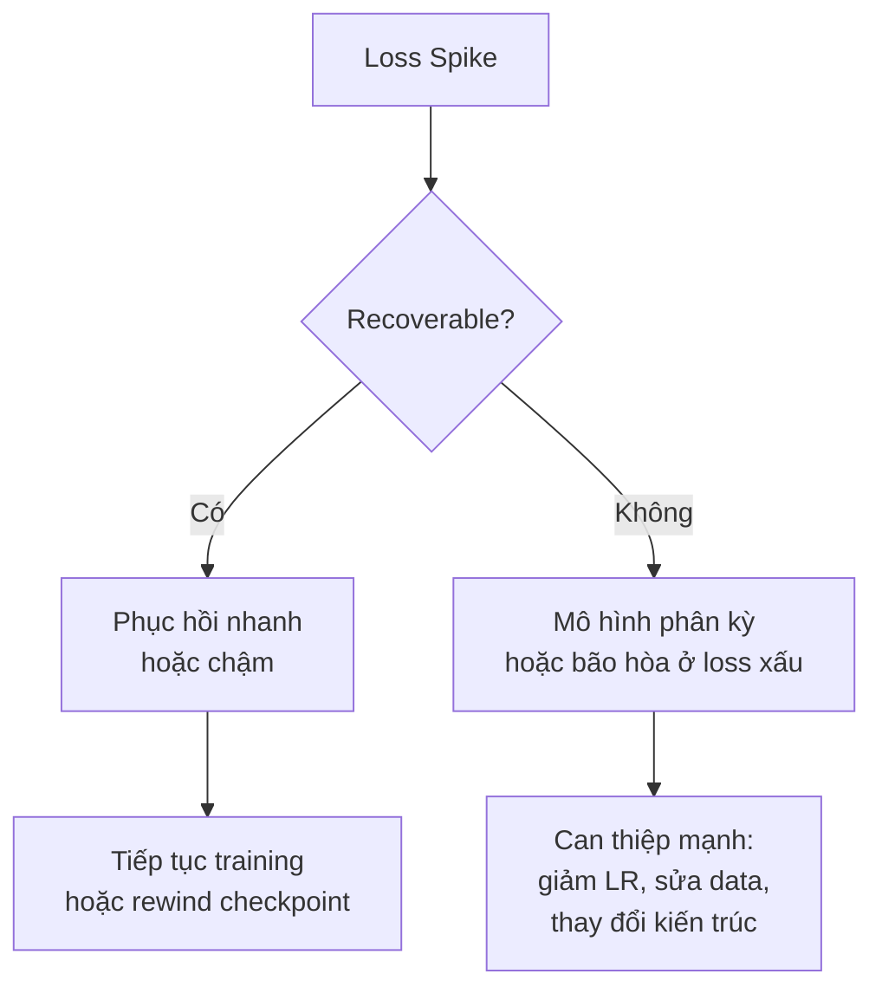
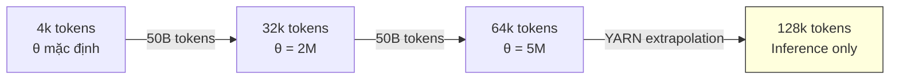

# Cuộc Marathon Huấn luyện

Chúc mừng bạn đã đi được đến đây — phần vui thực sự sắp bắt đầu!

Tại thời điểm này, mọi thứ đã sẵn sàng: kiến trúc đã được xác nhận, data mixture đã hoàn thiện, và siêu tham số đã tinh chỉnh. Việc duy nhất còn lại là thiết lập hạ tầng và nhấn nút "train".

Đối với SmolLM3, huấn luyện trên **384 GPU H100** (48 node) trong gần **một tháng**, xử lý **11 nghìn tỷ token**. Phần này sẽ dẫn bạn qua những gì thực sự xảy ra trong một cuộc huấn luyện dài: các kiểm tra trước khi bay, những bất ngờ không tránh khỏi, và cách giữ mọi thứ ổn định.

> Đội ngũ đã trải qua nhiều lần: từ StarCoder, StarCoder2 đến SmolLM, SmolLM2, và bây giờ SmolLM3. Mỗi lần chạy đều khác nhau. Dù bạn đã huấn luyện hàng tá mô hình, mỗi lần chạy mới đều tìm ra cách mới để gây bất ngờ.

## Checklist Trước khi Bay

Trước khi nhấn "train", cần kiểm tra mọi thứ hoạt động end-to-end:

### 1. Sẵn sàng Hạ tầng
- **Dùng Slurm reservation** nếu cluster hỗ trợ. SmolLM3 có reservation 48 node cố định cho toàn bộ lần chạy — không trì hoãn hàng đợi, throughput nhất quán, và khả năng theo dõi sức khỏe node theo thời gian.
- **Stress-test GPU** trước khi khởi chạy (dùng GPU Fryer và DCGM Diagnostics) để phát hiện throttling hoặc suy giảm hiệu suất. SmolLM3 tìm thấy 2 GPU throttling và thay thế trước khi bắt đầu.
- **Tránh phình bộ nhớ lưu trữ**: Hệ thống upload mỗi checkpoint lên S3, rồi xóa bản local ngay sau khi lưu checkpoint tiếp theo.

### 2. Thiết lập Đánh giá
Evaluations (đánh giá) tốn thời gian đáng ngạc nhiên. Tự động hóa hoàn toàn nếu có thể, và đảm bảo chúng đang chạy và ghi log đúng trước khi bắt đầu. SmolLM3: mỗi checkpoint được lưu tự động trigger job đánh giá trên cluster, ghi log vào Wandb và Trackio.

### 3. Checkpoint & Auto-resume
Xác minh checkpoint được lưu đúng và training job có thể resume từ checkpoint mới nhất mà không cần can thiệp thủ công. Trên Slurm, dùng tùy chọn `--requeue` để job thất bại tự động được chạy lại.

### 4. Logging Metrics
Đảm bảo đang ghi log tất cả metric quan trọng: điểm đánh giá, throughput (token/giây), training loss, gradient norm, sức khỏe node (GPU utilization, nhiệt độ, memory usage).

## Bất ngờ khi Mở rộng Quy mô

Sau khi chạy ablation kỹ lưỡng, SmolLM3 sẵn sàng cho lần chạy toàn diện. Các ablation 3B trên 100B token trông đầy hứa hẹn. Model FLOPs Utilization (MFU — Hiệu suất sử dụng FLOPs của mô hình) được tối ưu khoảng **30%** trên 384 GPU.

Sẵn sàng cho cuộc lớn: **11T token**. Đó là lúc thực tế bắt đầu "ném bóng cong".


Ba thứ thay đổi so với ablation:
1. **Kích thước tập dữ liệu**: ~24 TB đầy đủ thay vì subset nhỏ
2. **Số bước huấn luyện**: Step count thực cho 11T token thay vì horizon 100B
3. **Trạng thái phần cứng**: GPU hoạt động tốt trong ablation có thể lỗi dưới tải liên tục

## Câu chuyện Bug: Những Bí ẩn và Cách Giải quyết

### Mystery #1 — Throughput Biến mất

Trong vòng vài giờ sau khởi chạy, throughput sụp đổ. Giảm dốc, với nhiều lần giảm mạnh lặp đi lặp lại.

> Throughput đo bao nhiêu token/giây hệ thống xử lý. Giảm 50% throughput nghĩa là lần chạy 1 tháng trở thành 2 tháng.

Kiểm tra metric giám sát node cho thấy throughput giảm tương quan với spike trong **latency đọc đĩa**. Nguyên nhân: Hệ thống lưu trữ FSx (Weka) đang bị đẩy đến giới hạn với 24 TB dữ liệu huấn luyện. Nó bắt đầu **evict các shard dataset giữa huấn luyện**, gây stall khi phải fetch lại.

**Fix #1 — Đổi Lưu trữ Dữ liệu**: Lưu dữ liệu trên scratch storage cục bộ của từng node. Thêm hack: dự trữ node spare với dataset preloaded. Nếu node chết, swap ngay lập tức — zero recovery delay. Node spare khi rảnh chạy eval hoặc dev jobs.

### Mystery #2 — Throughput Drops Dai dẳng

Sau khi chuyển dữ liệu sang scratch, các drops riêng lẻ vẫn xảy ra. Kiểm tra trên ít node hơn — tái hiện trên **một node duy nhất**. Loại bỏ nguyên nhân phần cứng.

Biến duy nhất còn lại: **step count**. Test với step count nhỏ hơn (32k thay vì 3.2M) — drops nhỏ hơn!

```diff
## Short run (32k steps) — ổn định
- "lr_decay_starting_step": 2560000
- "lr_decay_steps": 640000
- "train_steps": 3200000
## Long run (3.2M steps) — có drops
+ "lr_decay_starting_step": 26000
+ "lr_decay_steps": 6000
+ "train_steps": 32000
```

Nguyên nhân: Dataloader `nanosets` của Nanotron xây dựng **một index khổng lồ phình to theo mỗi bước huấn luyện**. Với step rất lớn, shared memory usage tăng, gây throughput drops.

**Fix #2 — Đưa vào TokenizedBytes Dataloader**: Copy dataloader TokenizedBytes đã chứng minh từ SmolLM2 vào Nanotron. Drops biến mất, throughput trở lại mục tiêu.

### Mystery #3 — Loss Nhiễu

Với dataloader mới, không có throughput drops nhưng **đường cong loss nhiễu hơn**. Kiểm tra phát hiện: dataloader đang đọc sequences **tuần tự** từ mỗi document. Với domain như code, một file dài chất lượng thấp có thể lấp đầy toàn bộ batch và gây loss spikes.

**Fix #3 — Shuffle ở Mức Sequence**: Pre-shuffle tokenized sequences offline. Tạo sequences đã shuffle cho mỗi epoch với seed khác nhau (~1 giờ per epoch).

> Khi đối mặt deadline gấp, đôi khi nhanh hơn khi áp dụng giải pháp đã chứng minh hoặc workaround nhanh thay vì debug implementation bị hỏng. Nhưng cẩn thận đừng lấy quá nhiều shortcut, nếu không sẽ kết thúc với hệ thống chắp vá khó bảo trì.

### Mystery #4 — Hiệu suất Không đạt Kỳ vọng (Bug Tensor Parallelism)

Huấn luyện mượt 2 ngày. Ở mốc **~1T token**, evaluations tiết lộ điều bất ngờ: dù có nhiều tham số hơn và data mixture tốt hơn, mô hình 3B **kém hơn mô hình SmolLM2 1.7B** tại cùng điểm huấn luyện.

Sự khác biệt đáng ngờ nhất giữa hai setup: **Tensor Parallelism (TP)**. SmolLM2 vừa trên 1 GPU và huấn luyện không có TP, trong khi SmolLM3 cần TP=2.

**Phát hiện Bug**: Huấn luyện mô hình 1.7B với cùng setup SmolLM3, cả có và không có TP. Phiên bản TP liên tục có loss cao hơn. Vấn đề: **dùng cùng random seed trên tất cả TP rank**, trong khi mỗi rank phải được khởi tạo với seed khác nhau. Điều này gây khởi tạo trọng số tương quan giữa các shard, ảnh hưởng hội tụ.

```diff
# Fix bug TP seeding
- set_random_seed(self.config.general.seed)
+ # Set different random seed for each TP rank
+ tp_rank = dist.get_rank(self.parallel_context.tp_pg)
+ set_random_seed(self.config.general.seed + tp_rank)
```

**Fix #4**: Sau khi fix seed, ablation TP và non-TP **khớp nhau** cả loss curves và downstream performance.

> [!IMPORTANT]
> **Bài học:** "Giá trị thực sự của setup ablation vững chắc vượt xa việc xây mô hình tốt. Khi sai sót xảy ra trong lần huấn luyện chính, ta muốn tự tin vào mọi quyết định đã đưa ra và nhanh chóng xác định thành phần nào chưa được kiểm tra kỹ."

## Giám sát và Khi nào Khởi động lại

### Giám sát: Vượt xa Loss Curves

Lý do bắt được bug TP không phải nhờ loss curve (trông ổn), mà vì **evaluations downstream tụt hậu so với kỳ vọng**. Thêm vào đó, có evaluations từ checkpoints trung gian SmolLM2 cực kỳ quan trọng — cho chỉ dấu sớm rằng mô hình 3B không đi đúng hướng.

**Metric cơ sở hạ tầng quan trọng nhất**: Throughput (token/giây). SmolLM3 kỳ vọng ổn định **13,500–14,000 token/giây**. Bất kỳ sai lệch kéo dài nào là cờ đỏ.

Ngoài throughput, giám sát sức khỏe phần cứng liên tục: nhiệt độ GPU, sử dụng memory, compute utilization — log vào Grafana dashboards và Slack alerts real-time cho bất thường phần cứng.

### Fix và Khởi động lại vs. Fix giữa chừng

SmolLM3 khởi động lại sau 1T token — nhưng có phải lúc nào cũng cần khởi động lại? Phụ thuộc vào mức độ nghiêm trọng và nguyên nhân gốc:

- **Bug TP seeding**: Nửa trọng số không được khởi tạo đúng → restart hợp lý
- **Loss spikes**: Nhiều trường hợp có thể điều chỉnh giữa chừng

### Loss Spikes — Phân loại và Xử lý

Loss spikes chia thành hai loại:



**Nguyên nhân phổ biến** (giả sử kiến trúc và optimizer bảo thủ):
- **Learning rate cao**: Gây bất ổn sớm, fix bằng giảm LR
- **Dữ liệu xấu**: Nguyên nhân chính của recoverable spikes
- **Tương tác dữ liệu-tham số**: PaLM quan sát spikes thường từ *tổ hợp cụ thể* data batches và trạng thái tham số mô hình
- **Khởi tạo kém**: OLMo 2 chuyển từ scaled initialization sang normal distribution đơn giản (mean=0, std=0.02)
- **Vấn đề precision**: FP16 cực kỳ bất ổn so với BF16

**Phòng ngừa — Xây dựng Ổn định trước**:
- Lọc và shuffle dữ liệu — loại bỏ documents có n-gram lặp lại (32+ lần lặp của 1–13 token spans)
- Z-loss regularization giữ output logits không phát triển quá lớn
- Loại bỏ embeddings khỏi weight decay
- QK-norm (normalize query và key projections trước attention) — có thể áp dụng giữa chừng để sửa phân kỳ

**Khi spikes xảy ra — Kiểm soát Thiệt hại**:
- **Skip batches có vấn đề**: Rewind về trước spike và skip — Falcon skip 1B token, PaLM skip 200–500 batches
- **Thắt chặt gradient clipping**: Giảm ngưỡng gradient norm tạm thời
- **Áp dụng sửa kiến trúc**: QK-norm có thể hiệu quả

## Timeline Huấn luyện SmolLM3

Sau khi giải quyết tất cả bất ngờ, phần còn lại của tháng huấn luyện tương đối yên tĩnh — chỉ là công việc đều đặn biến hàng nghìn tỷ token thành mô hình hoàn thiện, gián đoạn bởi restarts do node failures.

## Giai đoạn Annealing và Multi-Stage Training

Pretraining LLM hiện đại thường bao gồm **nhiều giai đoạn** với data mixtures khác nhau, thường theo sau bởi giai đoạn cuối mở rộng context length:

| Giai đoạn | Token | Context | Nội dung |
|-----------|-------|---------|----------|
| **Stage 1** — Base Training | 8T | 4k | Web data (FineWeb-Edu, DCLM, FineWeb2, FineWeb2-HQ), code từ The Stack v2, math từ FineMath3+ |
| **Stage 2** — High-Quality Injection | 2T | 4k | Dataset lọc chất lượng cao hơn: Stack-Edu, FineMath4+, MegaMath |
| **Stage 3** — LR Decay | 1.1T | 4k | Upsample math/code + instruction/reasoning data (OpenMathReasoning, OpenCodeReasoning, OpenMathInstruct) |

Can thiệp có kế hoạch (giới thiệu FineMath4+, Stack-Edu ở stage 2) **kết hợp** can thiệp phản ứng (dựa trên giám sát hiệu suất). Sự linh hoạt này — dù theo curriculum đã lên kế hoạch hay thích ứng với lỗ hổng phát sinh — là điều cho phép tối đa hóa giá trị ngân sách compute.

## Mở rộng Context Dài: Từ 4k đến 128k Token

Context length xác định bao nhiêu văn bản mô hình có thể xử lý — quan trọng cho phân tích tài liệu dài, hội thoại nhiều lượt mạch lạc, và xử lý toàn bộ codebase.

### Tại sao Mở rộng Context giữa Huấn luyện?

Huấn luyện trên context dài từ đầu **cực kỳ đắt** vì cơ chế attention scale bậc hai với độ dài sequence. Nghiên cứu cho thấy mở rộng context với vài chục đến trăm tỷ token cuối huấn luyện đủ để đạt hiệu suất context dài tốt.

### Mở rộng Tuần tự: 4k → 32k → 64k

SmolLM3 không nhảy thẳng lên 128k. Thay vào đó, mở rộng dần qua từng giai đoạn:



- **4k → 32k**: Tăng RoPE base frequency (theta) lên 2M
- **32k → 64k**: Tăng theta lên 5M (10M cải thiện RULER nhẹ nhưng ảnh hưởng GSM8k)
- **64k → 128k**: Dùng **YARN** (Yet Another RoPE extensioN) để extrapolate — khả năng 128k đến từ extrapolation inference-time, không phải training

> Phát hiện bất ngờ: Không cần upsample tài liệu context dài (sách, bài viết dài) — baseline mixture từ stage 3 đã cạnh tranh với Llama 3.2 3B và Qwen2.5-3B trên RULER. Giả thuyết: baseline mixture tự nhiên bao gồm tài liệu dài từ web data và code (~10% token), và NoPE đã giúp.

### Sliding Window Attention

Thử nghiệm sliding window attention (window sizes 4k, 8k, 16k) trong mở rộng 4k→32k, nhưng **kém hơn full attention** trên RULER.

## Quy tắc Thực hành

> [!TIP]
> **Bài học từ SmolLM3**

- **Mỗi lần chạy đều khác nhau**: Dù đã huấn luyện hàng tá mô hình, chuẩn bị cho bất ngờ. Stack the odds in your favor.

- **Giám sát downstream evaluations, không chỉ loss**: Bug TP chỉ được phát hiện nhờ so sánh evaluations với checkpoints trung gian SmolLM2, không phải từ loss curve.

- **Giữ spare node**: Swap ngay lập tức khi node chết — zero downtime. Node spare khi rảnh chạy eval.

- **Ablation kỹ = debug nhanh**: Vì mọi thành phần khác trong setup đã được xác nhận, có thể xác định chính xác TP là nguyên nhân và fix bug trong **một ngày**.

- **Khi nghi ngờ, đơn giản hóa và kiểm tra**: Giảm số node, giảm step count, thay đổi từng biến một — cách debug hệ thống phân tán.

- **Ghi lại mọi thứ**: Throughput mục tiêu, metric baseline, setup thí nghiệm — khi sự cố xảy ra, bạn cần so sánh nhanh.

> *"Training loss plots giống mẫu nhịp tim — có cái tốt, cái xấu, và cái đáng lo ngại."* — Stas Bekman, Machine Learning Engineering Open Book
