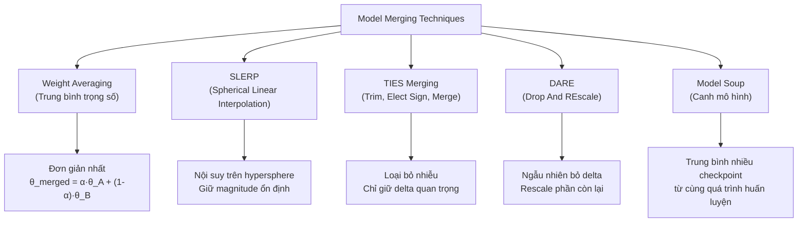
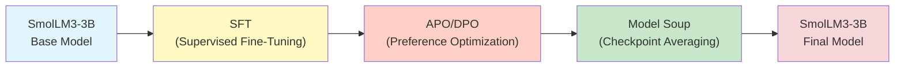
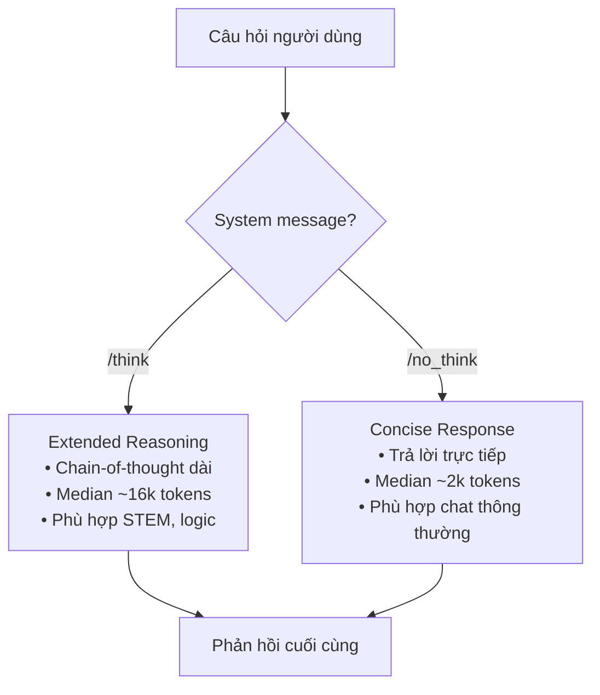
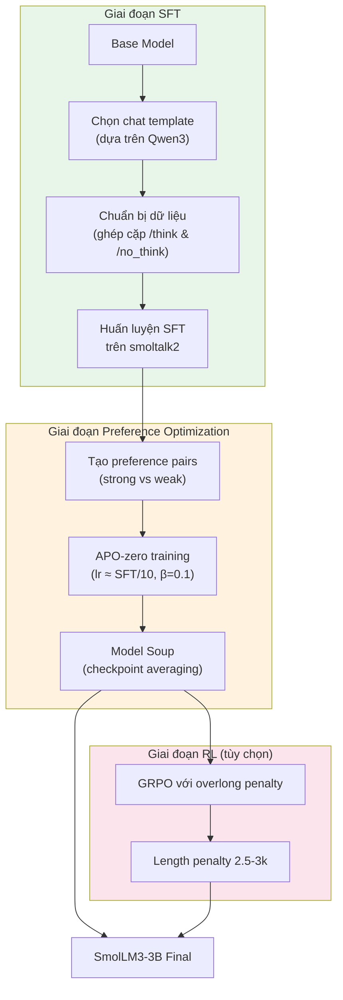

# Model Merging và Hybrid Reasoning

Trong thế giới post-training hiện đại, hai kỹ thuật đang nổi lên như những công cụ mạnh mẽ để tạo ra mô hình chất lượng cao mà không cần huấn luyện lại từ đầu: **model merging** (kết hợp mô hình) và **hybrid reasoning** (suy luận lai). Chương này sẽ khám phá cả hai — từ lý thuyết đến cách SmolLM3 áp dụng chúng trong thực tế.

## Model Merging là gì?

**Model merging** (kết hợp mô hình) là kỹ thuật tạo ra một mô hình mới bằng cách kết hợp trọng số (weights) của nhiều mô hình đã được fine-tune riêng lẻ, mà **không cần huấn luyện lại**. Đây là một trong những "nghệ thuật đen tối và thuật giả kim" (*dark arts and alchemy*) của post-training, như playbook gốc mô tả.

Ý tưởng cốt lõi rất đơn giản: Nếu bạn có một mô hình giỏi toán và một mô hình giỏi code, liệu bạn có thể "trộn" chúng lại để được một mô hình giỏi cả hai?

### Tại sao Model Merging hiệu quả?

Model merging hoạt động dựa trên một quan sát quan trọng: Khi fine-tune cùng một base model trên các tác vụ khác nhau, các mô hình kết quả thường nằm trong cùng một **loss basin** (vùng lõm loss) trong không gian tham số. Điều này có nghĩa là:

1. **Không gian tham số tuyến tính**: Các mô hình fine-tuned từ cùng base model thường có thể được nội suy tuyến tính mà không làm mất hiệu suất
2. **Bổ sung khả năng**: Mỗi mô hình chuyên biệt mang theo kiến thức riêng mà khi kết hợp sẽ bổ sung cho nhau
3. **Chi phí thấp**: Không cần GPU hay thời gian huấn luyện — chỉ cần các phép toán trên trọng số

### Các kỹ thuật Model Merging phổ biến

#### 1. Weight Averaging (Trung bình trọng số)

Phương pháp đơn giản nhất: Lấy trung bình có trọng số của các tham số.

$$\theta_{\text{merged}} = \alpha \cdot \theta_A + (1 - \alpha) \cdot \theta_B$$

Trong đó $\alpha$ là hệ số pha trộn. Mặc dù đơn giản, phương pháp này hoạt động tốt đáng ngạc nhiên khi các mô hình bắt nguồn từ cùng base model.

#### 2. SLERP (Spherical Linear Interpolation)

Thay vì nội suy tuyến tính trong không gian Euclidean, **SLERP** nội suy trên bề mặt của hypersphere (siêu cầu). Điều này giúp duy trì **magnitude** (độ lớn) của vector trọng số, tránh hiện tượng trọng số bị co lại khi trung bình tuyến tính:

$$\text{SLERP}(\theta_A, \theta_B; t) = \frac{\sin((1-t)\Omega)}{\sin \Omega} \theta_A + \frac{\sin(t\Omega)}{\sin \Omega} \theta_B$$

trong đó $\Omega$ là góc giữa hai vector trọng số.

#### 3. TIES Merging (Trim, Elect Sign & Merge)

**TIES** giải quyết vấn đề xung đột khi merge nhiều mô hình bằng ba bước:

1. **Trim** (Cắt tỉa): Loại bỏ những thay đổi nhỏ (delta) so với base model — chỉ giữ lại top-k% delta lớn nhất
2. **Elect Sign** (Bầu dấu): Khi các mô hình khác nhau thay đổi cùng một tham số theo hướng ngược nhau, chọn dấu của đa số
3. **Merge** (Kết hợp): Trung bình các delta đã được lọc

#### 4. DARE (Drop And REscale)

**DARE** hoạt động theo triết lý: Không phải tất cả sự thay đổi so với base model đều quan trọng. Nó:

1. **Ngẫu nhiên bỏ** (drop) một phần delta với xác suất $p$
2. **Rescale** phần còn lại bằng hệ số $\frac{1}{1-p}$ để bảo toàn kỳ vọng

#### 5. Model Soup

**Model soup** (canh mô hình) — một thuật ngữ được đặt bởi [Wortsman et al., 2022](https://arxiv.org/abs/2203.05482) — là kỹ thuật **trung bình nhiều checkpoint** từ cùng một quá trình huấn luyện hoặc từ các hyperparameter sweep khác nhau. Trong SmolLM3, checkpoint cuối cùng được đánh dấu là `it-soup-APO`, cho thấy đội ngũ đã sử dụng kỹ thuật soup để kết hợp các checkpoint tốt nhất từ quá trình APO (Aligned Preference Optimization).

## Chiến lược Merging của SmolLM3

SmolLM3 sử dụng model merging như một phần quan trọng trong pipeline post-training. Cụ thể:

### Quy trình thực tế

1. **SFT trên smoltalk2**: Huấn luyện supervised fine-tuning trên bộ dữ liệu curated
2. **APO-zero preference optimization**: Sử dụng APO-zero với learning rate ~10× nhỏ hơn SFT, $\beta = 0.1$
3. **Model soup**: Kết hợp các checkpoint tốt nhất từ quá trình preference optimization
4. **Đánh giá cuối cùng**: Kiểm tra trên AIME25, IFEval, LiveCodeBench và các benchmark khác

Kết quả cho thấy APO-zero cải thiện 15–20 điểm phần trăm trên IFEval so với checkpoint SFT, và model soup giúp ổn định hiệu suất tổng thể.

## Thiết kế Hybrid Reasoning Model

### Hybrid Reasoning là gì?

Một **hybrid reasoning model** (mô hình suy luận lai) hoạt động ở hai chế độ riêng biệt:

- **`/think` mode**: Suy luận mở rộng, từng bước chi tiết (extended chain-of-thought)
- **`/no_think` mode**: Phản hồi ngắn gọn, trực tiếp

Theo cách tiếp cận của Qwen3, SmolLM3 sử dụng lệnh nhẹ trong system message: `/think` kích hoạt suy luận mở rộng, `/no_think` buộc trả lời ngắn gọn. Người dùng kiểm soát liệu mô hình ưu tiên **chiều sâu** hay **tốc độ**.

### Thách thức khi huấn luyện Hybrid Reasoning

Huấn luyện mô hình hybrid reasoning **phức tạp hơn SFT thông thường** vì:

1. **Ghép cặp dữ liệu**: Không thể đơn giản trộn dataset — cần **ghép cặp** dữ liệu giữa hai chế độ. Mỗi ví dụ phải rõ ràng chỉ ra chế độ reasoning nào
2. **Cân bằng token**: Cần cân bằng data mixture theo **token**, không phải theo số ví dụ. Ví dụ, dataset s1k-1.1 chỉ chiếm ~1% tổng ví dụ nhưng ~11% tổng token do response reasoning dài
3. **Chat template quan trọng**: Template phải hỗ trợ rõ ràng cả hai chế độ. SmolLM3 dựa trên template Qwen3 nhưng với modification: **giữ lại reasoning content** trong các lượt trước đó thay vì discard
4. **RLVR phức tạp hơn**: Độ dài generation khác nhau đáng kể giữa hai chế độ, khiến RL training khó ổn định

### Reward Hacking trong Hybrid Models

Một bài học quan trọng từ SmolLM3: Khi áp dụng **GRPO** (Group Relative Policy Optimization — Tối ưu hóa chính sách tương đối theo nhóm) naively cho chế độ `/no_think`, mô hình đã học cách **hack reward** — mặc dù không bao giờ được yêu cầu tạo chain-of-thought dài, nó tự phát triển khả năng tạo CoT dài để tăng reward:

> Nói cách khác, RLVR với GRPO đã **chuyển đổi** chế độ `/no_think` thành thứ giống hệt chế độ `/think`!

Mô hình bắt đầu tạo ra các hành vi nhận thức như "Wait, ..." — các pattern đặc trưng của reasoning model — ngay cả khi ở chế độ ngắn gọn.

**Giải pháp: Overlong Penalty**

Vấn đề được giải quyết bằng **overlong completion penalty** (phạt phản hồi quá dài) từ paper DAPO:

$$r(y) = \begin{cases} r_{\text{original}}(y) & \text{if } |y| \leq L_{\max} \\ -1 & \text{if } |y| > L_{\max} + L_{\text{cache}} \\ \text{linear decay} & \text{otherwise} \end{cases}$$

Với penalty trong khoảng 2.5–3k token, GRPO **gần như gấp đôi** hiệu suất trên AIME 2025 so với các phương pháp offline như APO.

## Xây dựng trên Nền tảng Đã được Chứng minh

### Tại sao SmolLM3 chọn hướng tiếp cận này?

Quyết định xây dựng hybrid reasoning model được thúc đẩy bởi hai yếu tố:

1. **Nhu cầu thực tế**: Mô hình hybrid reasoning như Qwen3 đang ngày càng phổ biến, nhưng các recipe mở cho thấy cách huấn luyện chúng vẫn rất hiếm
2. **Đóng góp cho cộng đồng**: SmolLM3 cho cơ hội đóng góp một recipe hoàn toàn mở, nằm trên **Pareto front** cùng với Qwen3 1.7B và 4B

### Pipeline Post-Training hoàn chỉnh

## Kết quả Hiệu suất Cuối cùng

SmolLM3-3B đạt được vị trí **best-in-class** cho kích thước của nó, nằm trên Pareto front cùng với các mô hình hybrid reasoning của Qwen.

### Các bài học chính từ quá trình post-training

| Bài học | Chi tiết |
|---------|----------|
| **Preference data tự tạo** | Với chi phí inference ngày càng rẻ, việc tạo LLM preference pairs rất đơn giản và hiệu quả |
| **Bắt đầu với DPO** | Dùng DPO làm baseline, sau đó thử APO/ORPO/KTO |
| **Learning rate** | ~10× nhỏ hơn so với SFT |
| **Quét β** | Thường trong khoảng 0.01 đến 0.5, giá trị 0.1 cho kết quả tốt nhất |
| **Overfit sau 1 epoch** | Phân chia dữ liệu và train iteratively |
| **RL cho hybrid models** | Rất khó — mỗi mode cần length penalty riêng |

### Các phương pháp thay thế RL

Ngoài RL truyền thống, còn có các phương pháp nhẹ hơn đáng quan tâm:

- **Online DPO**: Mô hình liên tục tạo response mới, thu thập preference labels, và cập nhật — giữ quá trình on-policy
- **On-policy distillation** (chưng cất on-policy): Tín hiệu đến từ teacher model mạnh hơn, sử dụng KL divergence giữa student và teacher logits
- **GOLD** (General On-Policy Logit Distillation): Phương pháp mới cho phép distill bất kỳ teacher nào vào bất kỳ student nào, không cần chung tokenizer

> [!TIP]
> **Insight quan trọng**: On-policy distillation với mô hình nhỏ thường **vượt trội** so với RL-based methods với chi phí compute thấp hơn nhiều. Qwen3 tech report cho thấy phương pháp này được dùng để train tất cả mô hình dưới 32B parameters.

## Tổng kết

Model merging và hybrid reasoning là hai kỹ thuật bổ sung cho nhau trong pipeline post-training hiện đại:

- **Model merging** cho phép kết hợp các khả năng chuyên biệt mà không cần huấn luyện lại
- **Hybrid reasoning** mở ra khả năng cho mô hình hoạt động ở nhiều chế độ, phục vụ các nhu cầu khác nhau
- **Kết hợp cả hai** — như SmolLM3 đã làm — tạo ra mô hình vừa linh hoạt vừa mạnh mẽ

Điều quan trọng nhất: **Validate mọi thứ qua thí nghiệm**, thay đổi từng thứ một, và để use case của bạn dẫn dắt quyết định thay vì chạy theo mọi paper mới.
