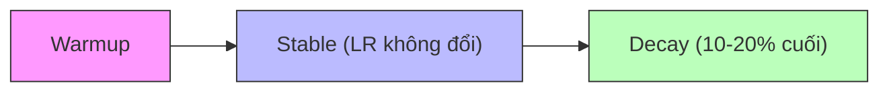

# Optimizer và Siêu tham số Huấn luyện

Các mảnh ghép đang dần hoàn thiện. Chúng ta đã chạy ablation (thí nghiệm loại bỏ), chốt kiến trúc và chọn tokenizer. Nhưng trước khi thực sự khởi động quá trình huấn luyện, vẫn còn những quyết định then chốt: Dùng optimizer (bộ tối ưu) nào? Learning rate (tốc độ học) và batch size (kích thước lô) bao nhiêu? Lịch trình learning rate nên như thế nào?

Cách tiếp cận hấp dẫn nhất là "mượn" các giá trị từ một mô hình mạnh trong tài liệu nghiên cứu. Rốt cuộc, nếu nó hiệu quả với các phòng lab lớn thì chắc cũng ổn cho chúng ta, đúng không? Và trong nhiều trường hợp, cách này hoạt động tốt — nếu ta lấy giá trị từ một kiến trúc và kích thước mô hình tương tự.

Tuy nhiên, chúng ta có nguy cơ bỏ lỡ hiệu suất tối ưu nếu không tinh chỉnh các giá trị này cho setup cụ thể của mình. Các siêu tham số (hyperparameter) được báo cáo trong tài liệu đã được tối ưu cho dữ liệu và ràng buộc cụ thể, và đôi khi những ràng buộc đó thậm chí không liên quan đến hiệu suất. Giá trị từ tài liệu luôn là điểm khởi đầu tốt, nhưng nên khám phá xem liệu ta có thể tìm được giá trị tốt hơn trong vùng lân cận hay không.

## Optimizers: AdamW và Hơn thế nữa

Optimizer nằm ở trung tâm của toàn bộ quy trình huấn luyện LLM. Nó quyết định cho mỗi tham số rằng bước cập nhật thực tế sẽ là gì, dựa trên các cập nhật trước đó, trọng số hiện tại, và gradient (đạo hàm) tính từ hàm mất mát. Đồng thời, nó cũng là một "con quái vật" ngốn bộ nhớ và tính toán, do đó có thể ảnh hưởng đến số lượng GPU cần thiết và tốc độ huấn luyện.

Vậy tại sao mọi người đều dùng AdamW? Một phần vì AdamW đã hoạt động tốt hơn — hoặc ít nhất ngang bằng — các đối thủ cạnh tranh ở nhiều quy mô khác nhau trong thời gian dài, và việc thay đổi một thành phần cốt lõi như vậy luôn đáng lo ngại — đặc biệt khi rất khó (tức là tốn kém) để kiểm tra hiệu quả trong các cuộc huấn luyện dài.

Hơn nữa, so sánh optimizer một cách công bằng khó hơn bạn tưởng. Quy mô thay đổi các động lực theo cách khó mô phỏng trong các ablation nhỏ. Thường xuyên, baseline (đường cơ sở) không được tinh chỉnh kỹ, nên các optimizer mới được so sánh với thiết lập AdamW yếu. Một nghiên cứu gần đây (Wen et al., 2025) cho thấy điều này một mình đã bóp méo các cải thiện được báo cáo đáng kể.

### AdamW

Adam (Adaptive Momentum Estimation — Ước lượng Động lượng Thích ứng) là một kỹ thuật tối ưu bậc nhất, nghĩa là nó chỉ nhìn vào gradient. Nó điều chỉnh learning rate cho từng tham số bằng cách sử dụng momentum (động lượng) từ các gradient trước đó.

Tại sao lại có chữ W? Trong SGD (Stochastic Gradient Descent — Giảm gradient ngẫu nhiên) tiêu chuẩn, ta có thể đơn giản cộng $\lambda \theta^2$ (với $\theta$ là trọng số) vào hàm mất mát để áp dụng L2 regularization (chính quy hóa L2). Nhưng nếu làm tương tự với Adam, learning rate thích ứng cũng sẽ ảnh hưởng đến L2 regularization, khiến cường độ chính quy hóa phụ thuộc vào độ lớn gradient — không phải điều ta muốn. **AdamW** áp dụng weight decay (phân rã trọng số) tách biệt khỏi vòng lặp tối ưu chính để khắc phục vấn đề này.

Điều thú vị là trong vài năm qua, các siêu tham số AdamW gần như không thay đổi:

| Tham số | Giá trị |
|---------|---------|
| β₁ | 0.9 |
| β₂ | 0.95 |
| Gradient norm clipping | 1.0 |
| Weight decay | 0.1 (Llama 3 405B giảm xuống 0.01) |

Cùng bộ ba này được tái sử dụng trong Llama 1, 2, 3 và DeepSeek-V1, V2, V3-671B, không hề thay đổi.

### Muon: Optimizer Bậc hai

Trong khi Adam là phương pháp bậc nhất vì chỉ sử dụng gradient, **Muon** là một optimizer bậc hai hoạt động trên góc nhìn ma trận (matrix view) của tensor tham số. Ba ý tưởng then chốt:

1. **Hình học ma trận thay vì cập nhật từng tham số**: AdamW tiền điều kiện *theo từng tham số* (second moment đường chéo). Muon xử lý mỗi ma trận trọng số như một đối tượng duy nhất và cập nhật theo $G = UV^{\top}$, nắm bắt cấu trúc không gian con hàng/cột.

2. **Bước đẳng hướng qua trực giao hóa (Newton-Schulz)**: Phân rã $G = U\Sigma V^{\top}$ bằng SVD (Singular Value Decomposition) tách biệt độ lớn ($\Sigma$) khỏi hướng (các không gian con $U, V$). Thay thế $G$ bằng $UV^{\top}$ loại bỏ các giá trị kỳ dị và làm bước cập nhật *đẳng hướng* trong các không gian con hoạt động — giảm thiên lệch theo trục và khuyến khích khám phá các hướng vốn bị triệt tiêu bởi các giá trị kỳ dị rất nhỏ. Tối ưu bậc hai thực sự xảy ra bên trong bước Newton-Schulz.

3. **Chịu được batch size lớn hơn**: Trong thực tế, Muon thường chấp nhận batch size cao hơn — đây có thể là động lực chính cho việc áp dụng Muon!

Gần đây, Muon đã được sử dụng trong các bản phát hành đình đám như Kimi K2 và GLM-4.5. Ngoài Muon, còn có cả một "vườn thú" optimizer: Shampoo, SOAP, PSGD, CASPR, DION, Sophia, Lion... Thậm chí AdamW cũng có các biến thể riêng như NAdamW, StableAdamW, v.v.

## Learning Rate (Tốc độ học)

Learning rate là một trong những siêu tham số quan trọng nhất cần thiết lập. Tại mỗi bước huấn luyện, nó kiểm soát mức độ điều chỉnh trọng số dựa trên gradient đã tính. Learning rate quá thấp khiến huấn luyện chậm đau đớn và có nguy cơ mắc kẹt ở cực tiểu xấu. Learning rate quá cao khiến optimizer nhảy quá xa, không bao giờ hội tụ — hoặc tệ hơn, loss phân kỳ.

Nhưng learning rate tốt nhất thậm chí không cố định, vì động lực học thay đổi trong quá trình huấn luyện. Learning rate cao hiệu quả ở giai đoạn đầu khi ta còn xa nghiệm tốt, nhưng gây bất ổn gần điểm hội tụ. Đây là lúc **lịch trình learning rate** (LR schedule) phát huy tác dụng: tăng dần từ 0 (warmup) để tránh hỗn loạn ban đầu, rồi giảm dần (decay) để ổn định vào cực tiểu tốt.

### Lịch trình Learning Rate: Vượt xa Cosine Decay

Trong thời gian dài, **cosine decay** là lịch trình mặc định: bắt đầu ở learning rate đỉnh sau warmup, rồi giảm mượt theo đường cong cosine. Cách này đơn giản và hiệu quả. Nhược điểm chính là **thiếu linh hoạt** — ta cần biết trước số bước huấn luyện, vì chu kỳ cosine phải khớp với tổng thời gian huấn luyện. Điều này thành vấn đề khi mô hình chưa bão hòa mà ta muốn huấn luyện thêm, hoặc khi chạy scaling laws cần huấn luyện cùng mô hình với số lượng token khác nhau.

Ngày nay, nhiều đội sử dụng các lịch trình không cần decay ngay sau warmup:

- **WSD (Warmup–Stable–Decay)**: Duy trì learning rate cao ổn định trong phần lớn quá trình huấn luyện, rồi giảm mạnh trong giai đoạn cuối (thường 10–20% số token cuối).
- **Multi-step**: Giảm learning rate theo các bước rời rạc. Ví dụ, DeepSeek LLM dùng lịch trình multi-step với các lần giảm ở 80% và 90% quá trình huấn luyện.

Các lịch trình này cho phép mở rộng huấn luyện giữa chừng mà không cần khởi động lại, decay sớm để thấy rõ tiến trình, và chạy thí nghiệm scaling laws trên nhiều lượng token khác nhau trong cùng một lần huấn luyện chính.

> **Về WSD**: Thời gian cooldown cần thiết để đạt hiệu suất ngang cosine giảm khi huấn luyện dài hơn. Khuyến nghị phân bổ 10–20% tổng token cho giai đoạn decay.

> **Về Multi-step**: Các ablation của DeepSeek LLM cho thấy phân chia 80/10/10 (ổn định đến 80%, bước 1 từ 80–90%, bước 2 từ 90–100%) khớp cosine, nhưng có thể vượt cosine bằng cách điều chỉnh tỷ lệ (ví dụ 70/15/15 hoặc 60/20/20).

### Ablation: WSD khớp Cosine

So sánh cosine decay với WSD sử dụng hai cửa sổ decay: 10% và 20%.

Kết quả đánh giá cho thấy hiệu suất cuối cùng tương đương nhau giữa cả ba cấu hình. Nhìn vào đường cong loss và đánh giá (cụ thể HellaSwag), có một mẫu hình thú vị: Cosine đạt loss và điểm đánh giá tốt hơn trong giai đoạn ổn định (trước khi WSD bắt đầu decay). Tuy nhiên, khi WSD vào giai đoạn decay, có sự cải thiện gần như tuyến tính ở cả loss và metric downstream, cho phép WSD bắt kịp cosine vào cuối quá trình huấn luyện.

**Kết luận**: WSD với 10–20% decay đủ để khớp hiệu suất cuối cùng của cosine, đồng thời duy trì sự linh hoạt để mở rộng huấn luyện giữa chừng. SmolLM3 chọn WSD với 10% decay.

### Tìm Learning Rate Tối ưu: LR Sweeps

Để minh họa tác động của learning rate, thực hiện sweep trên mô hình ablation 1B huấn luyện trên 45B token với bốn learning rate: 1e-4, 5e-4, 5e-3, 5e-2:

| Learning Rate | Kết quả |
|--------------|---------|
| **5e-2** | Phân kỳ gần như ngay lập tức — loss tăng vọt và không bao giờ phục hồi |
| **1e-4** | Quá bảo thủ — hội tụ chậm hơn nhiều so với các learning rate khác |
| **5e-4** & **5e-3** | Hội tụ tốt và hiệu suất tương đương nhau |

Đối với SmolLM3, huấn luyện mô hình 3B trên 100B token với AdamW sử dụng WSD, so sánh nhiều learning rate. Kết quả: **2e-4** hội tụ nhanh hơn nhiều so với 1e-4, trong khi 3e-4 chỉ tốt hơn một chút so với 2e-4. Lợi ích biên từ 3e-4 đi kèm rủi ro bất ổn trong huấn luyện dài, nên chọn **2e-4** là điểm cân bằng.

Các sweep giúp loại bỏ learning rate rõ ràng quá cao (phân kỳ) hoặc quá thấp (hội tụ chậm) — nhưng kết quả cho các lần huấn luyện ngắn có thể không chuyển đổi chính xác sang lần huấn luyện đầy đủ. Đây là lúc **scaling laws** trở nên vô giá (xem chương tiếp theo).

## Batch Size (Kích thước lô)

Batch size là số lượng mẫu được xử lý trước khi cập nhật trọng số mô hình. Nó ảnh hưởng trực tiếp đến cả hiệu quả huấn luyện và hiệu suất cuối cùng.

Tăng batch size cải thiện throughput (thông lượng) nếu phần cứng và stack huấn luyện mở rộng tốt qua nhiều thiết bị. Nhưng vượt quá một điểm nhất định, batch lớn hơn bắt đầu **ảnh hưởng đến hiệu quả dữ liệu**: mô hình cần nhiều tổng token hơn để đạt cùng loss. Điểm ngưỡng này gọi là **critical batch size** (kích thước lô tới hạn, McCandlish et al., 2018).

### Toán học về Batch Size

Khi lấy trung bình trên $B$ mẫu:

- **Batch gradient**: $\tilde{g}_{B} = \frac{1}{B}\sum_{i=1}^{B} \tilde{g}^{(i)}$
- **Kỳ vọng không đổi**: $\mathbb{E}\left[\tilde{g}_{B}\right] = g$
- **Nhưng phương sai co lại**: $\mathrm{Cov}\left(\tilde{g}_{B}\right) = \frac{\Sigma}{B}$

Cập nhật tham số SGD:

$$\Delta w = -\eta \tilde{g}_{B}$$

Phương sai của cập nhật này tỷ lệ với:

$$\mathrm{Var}(\Delta w) \propto \eta^{2} \frac{\Sigma}{B}$$

Vì vậy, để giữ phương sai cập nhật xấp xỉ không đổi, nếu tăng batch size lên $k$ lần, ta muốn tăng learning rate lên $\sqrt{k}$ lần. Quy tắc ngón tay cái: **tỷ lệ căn bậc hai cho LR khi batch size tăng** — nhưng chính xác cách này hoạt động phụ thuộc vào optimizer. Ví dụ, với AdamW, có tương tác với `beta1` / `beta2` tạo ra hành vi rất khác.

### Critical Batch Size

Critical batch size không cố định — nó **tăng theo tiến trình huấn luyện**. Đầu huấn luyện, mô hình đang thực hiện các bước gradient lớn nên $\lVert g \rVert^2$ lớn, critical batch size nhỏ. Sau đó, khi các cập nhật ổn định, batch lớn hơn trở nên hiệu quả hơn. Đây là lý do một số cuộc huấn luyện quy mô lớn sử dụng **batch size warmup**. Ví dụ, DeepSeek-V3 bắt đầu với batch 12.6M cho ~469B token đầu, rồi tăng lên 62.9M cho phần còn lại.

Trong thực tế, cách chọn batch size và learning rate:
1. Chọn batch size và learning rate tối ưu, dựa trên scaling laws hoặc tài liệu
2. Tinh chỉnh batch size để xem có thể cải thiện throughput không

> **Insight chính**: Thường có một khoảng giữa batch size khởi đầu và critical batch size nơi bạn có thể tăng để cải thiện sử dụng phần cứng mà không hy sinh hiệu quả dữ liệu — nhưng phải điều chỉnh lại learning rate tương ứng.

## SmolLM3 đã chọn gì?

Trong quá trình ablation, SmolLM3 so sánh **AdamW**, **AdEMAMix** và **Muon** trên mô hình 1B huấn luyện trên 100B token:

| Optimizer | Kết quả |
|-----------|---------|
| **Muon** | Vượt AdamW khi tinh chỉnh đúng, nhưng nhạy cảm với LR và dễ phân kỳ |
| **AdEMAMix** | Loss tương tự Muon, ít nhạy cảm hơn |
| **AdamW** | Ổn định nhất nhưng loss cuối cùng cao hơn |

Khi mở rộng lên 3B, gặp phân kỳ thường xuyên hơn với Muon và AdEMAMix — có thể do bug song song hóa phát hiện sau (xem "Cuộc Marathon Huấn luyện"). Quyết định cuối cùng:

| Thành phần | Lựa chọn SmolLM3 |
|------------|-------------------|
| Optimizer | AdamW (β₁=0.9, β₂=0.95) |
| Weight decay | 0.1 |
| Gradient clipping | 1.0 |
| LR Schedule | WSD (10% decay) |
| Learning rate | 2e-4 |
| Global batch size (GBS) | 2.36M token |

Đối với GBS, đã thử nghiệm giá trị từ 2M đến 4M token nhưng thấy ít ảnh hưởng đến loss hoặc hiệu suất downstream, nên chọn **2.36M token** — kích thước cho throughput tốt nhất.

## Quy tắc Thực hành

:::tip TL;DR
Cân bằng giữa khám phá và thực thi. Hoàn thành tốt hơn hoàn hảo.
:::

- **Khi nghi ngờ, chọn linh hoạt và ổn định hơn hiệu suất đỉnh**. Nếu hai phương pháp có hiệu suất ngang nhau, chọn cái linh hoạt hơn hoặc có triển khai chín muồi và ổn định hơn. Lịch trình learning rate như WSD cho phép mở rộng huấn luyện hoặc chạy thí nghiệm giữa chừng có giá trị hơn lịch trình cứng nhắc có thể hội tụ tốt hơn chút ít.

- **Biết khi nào dừng tối ưu và bắt đầu huấn luyện**. Luôn còn một siêu tham số nữa để tinh chỉnh hoặc một optimizer nữa để thử. Đặt deadline cho việc khám phá và tuân thủ — mô hình bạn thực sự hoàn thành huấn luyện sẽ luôn thắng mô hình hoàn hảo mà bạn không bao giờ bắt đầu.

- **Phân bổ thời gian khôn ngoan** giữa khám phá và thực thi. Dành hàng tuần hoàn thiện cải tiến nhỏ từ phương pháp mới ít giá trị hơn đầu tư cùng lượng compute vào data curation tốt hơn hoặc ablation kiến trúc kỹ hơn. Từ kinh nghiệm, dù có thể làm thất vọng những người đam mê kiến trúc, **lợi ích hiệu suất lớn nhất thường đến từ data curation**.

> *"Hoàn hảo là kẻ thù của tốt, đặc biệt khi chúng ta làm việc với ngân sách compute hữu hạn và deadline."*
