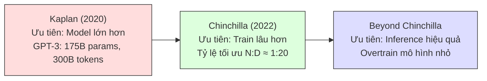

# Scaling Laws: Bao nhiêu Tham số, Bao nhiêu Dữ liệu?

Trong những ngày đầu của deep learning (học sâu), trước khi các mô hình ngôn ngữ (và cụm máy tính huấn luyện chúng) trở nên "lớn", các lần huấn luyện thường không bị ràng buộc nặng nề bởi compute (tài nguyên tính toán). Bạn chỉ cần chọn mô hình và batch size lớn nhất vừa với phần cứng, rồi huấn luyện cho đến khi mô hình bắt đầu overfitting (quá khớp) hoặc hết dữ liệu. Tuy nhiên, ngay cả trong những ngày đầu đó, đã có cảm nhận rằng quy mô hữu ích — ví dụ Hestness et al. (2017) cung cấp một tập kết quả toàn diện cho thấy huấn luyện mô hình lớn hơn, lâu hơn tạo ra lợi ích có thể dự đoán được.

Trong kỷ nguyên LLM, chúng ta **luôn bị ràng buộc bởi compute**. Vì sao?

## Ngân sách Compute: $C \approx 6 \times N \times D$

Để áp dụng scaling laws, ta cần cách đo lường quy mô huấn luyện. Chỉ số chuẩn là **ngân sách compute**, ký hiệu $C$, có thể xấp xỉ bằng:

$$C \approx 6 \times N \times D$$

Trong đó:
- $N$ = số tham số mô hình (ví dụ 1B = 1×10⁹)
- $D$ = số token huấn luyện

Đo bằng FLOPs (floating-point operations — phép tính dấu phẩy động), một cách đo lường không phụ thuộc phần cứng. Hằng số 6 đến từ ước lượng thực nghiệm: khoảng 6 FLOPs cho mỗi tham số mỗi token.

> Nếu FLOPs cảm thấy quá trừu tượng, hãy nghĩ đơn giản: Huấn luyện mô hình 1B trên 100B token tiêu tốn khoảng 2× ít FLOPs hơn huấn luyện mô hình 2B trên 100B token, hoặc mô hình 1B trên 200B token.

Nếu muốn đo chính xác hơn kể cả các lớp MoE và hybrid, tham khảo hàm `num_floating_point_operations` trong Megatron-LM.

## Lịch sử: Kaplan → Chinchilla → Vượt xa Chinchilla

### Kaplan et al. — "Quy mô lớn hơn là tốt hơn"

Các khái niệm ban đầu về khả năng mở rộng được hình thức hóa bởi nghiên cứu của Kaplan et al. trong ["Scaling Laws for Neural Language Models"](https://arxiv.org/abs/2001.08361), cho thấy hiệu suất mô hình ngôn ngữ có thể dự đoán được đáng kể qua nhiều bậc quy mô. Điều này kích hoạt cuộc chạy đua xây dựng mô hình lớn hơn trên lượng dữ liệu lớn hơn với ngân sách compute ngày càng tăng.

Scaling laws của Kaplan gợi ý rằng nên phân bổ nhiều compute hơn cho **quy mô mô hình** so với thực tiễn trước đó — thúc đẩy việc huấn luyện mô hình khổng lồ GPT-3 (175B tham số) trên lượng token tương đối khiêm tốn (300B token).

### Chinchilla — "Huấn luyện lâu hơn và tốt hơn"

Hoffmann et al. (2022) phát hiện vấn đề phương pháp luận trong cách tiếp cận của Kaplan, cuối cùng tái tạo scaling laws gợi ý phân bổ nhiều compute hơn cho **thời gian huấn luyện**. Ví dụ, huấn luyện compute-optimal cho GPT-3 175B lẽ ra phải tiêu tốn **3.7T token**! Các scaling laws sửa đổi này được gọi là **luật Chinchilla**, đặt theo tên mô hình Chinchilla.

### Vượt xa Chinchilla: Compute-Optimal vs. Inference-Optimal

Sự phát triển này chuyển lĩnh vực từ "làm mô hình lớn hơn" sang "huấn luyện chúng lâu hơn và tốt hơn". Tuy nhiên, hầu hết các lần huấn luyện hiện đại vẫn **không tuân thủ nghiêm ngặt luật Chinchilla**, vì chúng có một thiếu sót:

> Luật Chinchilla nhắm đến dự đoán kích thước mô hình và thời gian huấn luyện đạt hiệu suất tốt nhất với ngân sách compute nhất định, nhưng **không tính đến việc mô hình lớn hơn đắt hơn sau khi huấn luyện** (tại thời điểm inference).

Nói cách khác, ta thực sự có thể thích sử dụng ngân sách compute để huấn luyện mô hình **nhỏ hơn, lâu hơn**, dù không phải "compute-optimal", vì chi phí inference sẽ rẻ hơn (Sardana et al., 2025; de Vries, 2023). Điều này đặc biệt đúng khi mô hình sẽ được sử dụng nhiều tại inference (ví dụ vì nó được phát hành công khai 🤗).

## Xu hướng Overtrained Models (Mô hình huấn luyện quá mức)

Gần đây, thực tiễn **"overtraining"** — huấn luyện vượt xa thời gian mà scaling laws gợi ý — đã trở thành tiêu chuẩn. Các mô hình hiện đại được huấn luyện *cực kỳ quá mức* so với Chinchilla optimal:

| Mô hình | Tham số | Token huấn luyện | Hệ số so với Chinchilla |
|---------|---------|-------------------|------------------------|
| Llama 3.2 3B | 3B | ~3T | ~50× |
| Qwen3 series | Nhiều | 36T (tuyên bố) | Rất cao |
| **SmolLM3** | **3B** | **11T** | **~50×** |

## Scaling Laws cho Siêu tham số

Scaling laws không chỉ cho biết nên dùng bao nhiêu tham số và bao nhiêu dữ liệu — chúng còn giúp dự đoán cách điều chỉnh **learning rate** và **batch size** khi mở rộng quy mô, như được chứng minh bởi DeepSeek LLM và Qwen2.5.

### Cách tiếp cận của DeepSeek LLM

Quy trình rút ra scaling laws cho siêu tham số:

1. **Chọn LR schedule** — lý tưởng là WSD vì tính linh hoạt
2. **Huấn luyện mô hình** qua nhiều ngân sách compute (ví dụ 1e17, 5e17, 1e18, 5e18, 1e19, 2e19 FLOPs) với các tổ hợp batch size và learning rate khác nhau
3. **Xác định cấu hình gần tối ưu** — nằm trong biên nhỏ (ví dụ 0.25%) so với validation loss tốt nhất
4. **Vẽ trên thang log-log** — các mối quan hệ thường tuân theo luật lũy thừa (power law), xuất hiện như đường thẳng xấp xỉ
5. **Fit dữ liệu** để trích xuất scaling laws mô tả cách siêu tham số tối ưu biến đổi theo compute

### Phát hiện quan trọng

Với kích thước mô hình và ngân sách compute cố định, hiệu suất **duy trì ổn định qua một phạm vi rộng các siêu tham số**. Điều này có nghĩa là có một "vùng ngọt" rộng thay vì một cực trị hẹp — ta không cần tìm giá trị hoàn hảo, chỉ cần giá trị đủ gần, làm toàn bộ quy trình thực tế hơn nhiều.

**Trực giác cốt lõi**: Khi huấn luyện lớn hơn và dài hơn, ta muốn **cập nhật ổn định hơn** (learning rate nhỏ hơn) và **ước lượng gradient hiệu quả hơn** (batch size lớn hơn).

## SmolLM3: 3B × 11T = 50× Chinchilla Optimal

Dù scaling laws cung cấp gợi ý cho kích thước mô hình và thời gian huấn luyện, việc chọn overtrain đồng nghĩa phải tự quyết định các yếu tố này:

### Chọn kích thước mô hình

SmolLM3 bắt đầu bằng chọn mục tiêu **3B tham số**. Dựa trên các mô hình gần đây ở quy mô tương tự (Qwen3-4B, Gemma 3 4B, Llama 3.2 3B), 3B được coi là:
- **Đủ lớn** để mô hình có khả năng ý nghĩa (suy luận, gọi công cụ)
- **Đủ nhỏ** để cho phép inference siêu nhanh và sử dụng cục bộ hiệu quả

### Chọn thời gian huấn luyện

Thời gian huấn luyện thường được quyết định bởi lượng compute sẵn có. SmolLM3 có **384 H100** trong khoảng một tháng, cung cấp ngân sách cho **11T token** huấn luyện (giả sử MFU — Model FLOPs Utilization khoảng ~30%).

### Giá trị thực tế của Scaling Laws

Dù có những sai lệch so với compute-optimal, scaling laws vẫn có **giá trị thực tiễn**:

- Cung cấp **baseline cho thiết kế thí nghiệm** — nhiều người dùng setup Chinchilla-optimal để có tín hiệu trên ablation
- Giúp **dự đoán** liệu kích thước mô hình nhất định có thể đạt hiệu suất mục tiêu hay không
- Như Harm de Vries lưu ý trong "Go Smol or Go Home": bằng cách giảm kích thước mô hình, bạn có thể chạm ngưỡng **critical model size** — dung lượng tối thiểu cần thiết để đạt loss nhất định, dưới mức đó bạn bắt đầu nhận lợi ích giảm dần

> **Tóm lại**: Scaling laws là la bàn, không phải bản đồ chi tiết. Chúng cho biết hướng đi đúng, nhưng điểm đến cuối cùng phụ thuộc vào ràng buộc thực tế — phần cứng, ngân sách, mục đích sử dụng, và chi phí inference.
