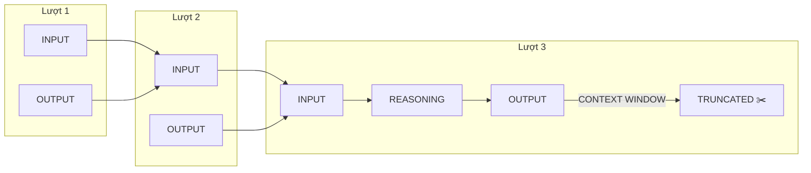
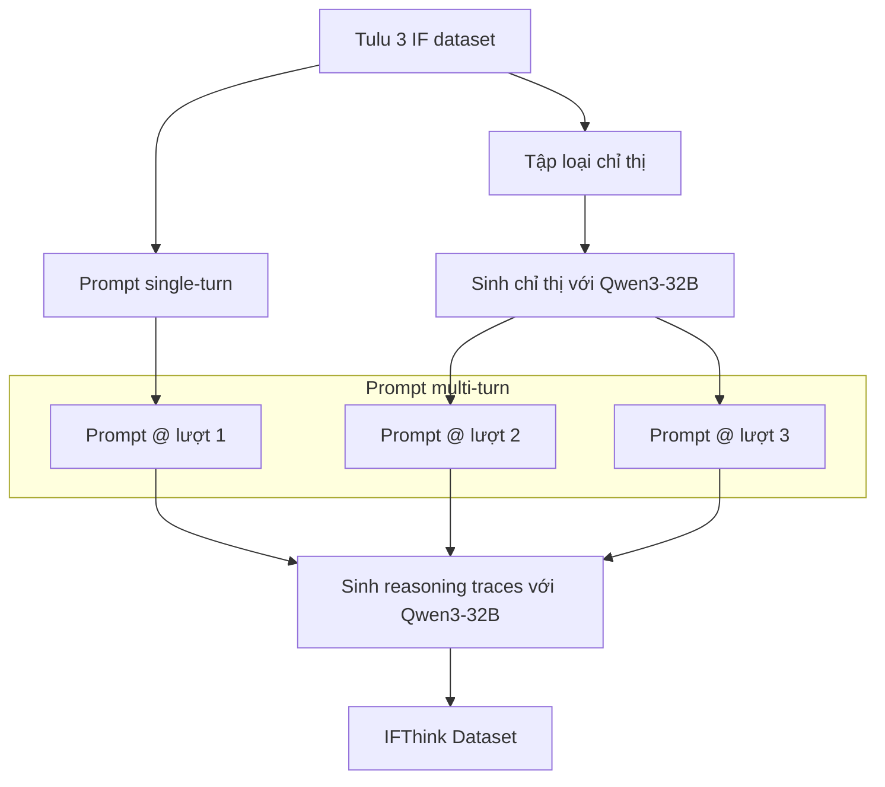
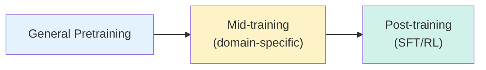

# SFT: Tinh chỉnh có Giám sát (Supervised Fine-Tuning)

## Tại sao (hầu hết) mọi pipeline post-training đều bắt đầu bằng SFT

Nếu bạn dành thời gian trên X ngày nay, bạn có thể nghĩ Reinforcement Learning (RL) là trò chơi duy nhất. Mỗi ngày mang đến những viết tắt mới, tinh chỉnh thuật toán, và tranh luận nảy lửa về việc liệu RL có thể khơi gợi khả năng mới hay không.

Như chúng ta sẽ thấy, RL thực sự hoạt động, nhưng đi kèm với nhiều đánh đổi thực tế.

Một điều không thay đổi: **hầu hết mọi pipeline post-training hiệu quả vẫn bắt đầu bằng SFT.** Lý do rất đơn giản:

- **Rẻ:** SFT yêu cầu compute khiêm tốn so với RL. Bạn thường có thể đạt được cải thiện đáng kể mà không cần đốt cháy núi silicon, và trong thời gian ngắn hơn nhiều so với RL.
- **Ổn định:** Không giống RL — nổi tiếng nhạy cảm với thiết kế reward và hyperparameter — SFT "cứ chạy là được."
- **Đúng baseline:** Một checkpoint SFT tốt thường mang lại phần lớn cải thiện bạn cần, và khiến các phương pháp sau như DPO hoặc RLHF hiệu quả hơn đáng kể.

> [!NOTE]
> Ở frontier (biên giới nghiên cứu), lý do thông thường để bắt đầu với SFT không phải lúc nào cũng áp dụng. Không có mô hình mạnh hơn để distill, và annotation từ con người quá nhiễu cho các hành vi phức tạp như suy luận chain-of-thought dài. Đó là lý do DeepSeek bỏ qua SFT và đi thẳng vào RL với R1-Zero. Nhưng nếu bạn đang ở chế độ đó, có lẽ bạn không cần đọc bài này.

## Chọn Base Model

Khi chọn base model cho post-training, một số chiều thực tế quan trọng nhất:

| Yếu tố | Mô tả |
|---------|-------|
| **Kích thước mô hình** | Mô hình lớn hơn tổng quát hóa tốt hơn, thường với ít mẫu hơn. Chọn kích thước phù hợp với cách triển khai. |
| **Kiến trúc (MoE vs. dense)** | MoE kích hoạt tập con tham số mỗi token — tốt cho serving quy mô lớn nhưng khó fine-tune hơn. Dense đơn giản hơn và thường vượt trội ở quy mô nhỏ. |
| **Track record post-training** | Benchmark hữu ích, nhưng tốt hơn nữa nếu base model đã sinh ra nhiều mô hình post-trained mạnh được cộng đồng ưa chuộng. |

> [!TIP]
> Theo kinh nghiệm của chúng tôi, base model từ **Qwen, Mistral, và DeepSeek** dễ post-train nhất, với Qwen là lựa chọn rõ ràng vì mỗi series thường bao phủ phạm vi tham số rộng (Qwen3 từ 0.6B đến 235B!).

## Huấn luyện Baseline đơn giản

Với SFT, một baseline tốt cần: huấn luyện nhanh, tập trung vào kỹ năng cốt lõi, và dễ mở rộng thêm dữ liệu khi cần. Chọn dataset nào cho baseline ban đầu đòi hỏi một chút "gu" và sự quen thuộc với những dataset có chất lượng cao.

**Tránh over-index vào dataset công khai báo cáo điểm cao trên benchmark học thuật** — thay vào đó hãy tập trung vào những dataset đã được dùng để huấn luyện mô hình tuyệt vời, như [OpenHermes](https://huggingface.co/datasets/teknium/OpenHermes-2.5).

Ví dụ, khi phát triển SmolLM, ban đầu chúng tôi chạy SFT trên [WebInstruct](https://huggingface.co/datasets/TIGER-Lab/WebInstructFull) — một dataset tuyệt vời trên giấy. Tuy nhiên, trong vibe test, chúng tôi phát hiện nó quá thiên về khoa học — mô hình phản hồi bằng phương trình cho những lời chào đơn giản như "Bạn khỏe không?"

> [!IMPORTANT]
> Việc sử dụng vibe testing để phát hiện quirk trong training data là chủ đề lặp đi lặp lại trong chương này — đừng đánh giá thấp sức mạnh của việc đơn giản *trò chuyện với mô hình!*

Với SmolLM3, chúng tôi chọn một tập nhỏ dataset nhắm đến reasoning, instruction following và steerability (khả năng điều khiển). Huấn luyện hybrid reasoning model phức tạp hơn SFT thông thường vì bạn không thể chỉ trộn dataset lại — bạn cần *ghép cặp* dữ liệu giữa các chế độ. Mỗi mẫu phải chỉ rõ liệu mô hình nên tham gia suy luận mở rộng hay đưa câu trả lời ngắn gọn.

> [!TIP]
> Hãy cân bằng data mixture theo **tokens**, không phải examples: ví dụ, dataset s1k-1.1 chiếm ~1% tổng số mẫu nhưng ~11% tổng số tokens do phản hồi suy luận dài.

## Chọn Chat Template phù hợp

Không có giải pháp one-size-fits-all cho chat template. Một số câu hỏi đáng xem xét:

| Câu hỏi | Giải thích |
|----------|------------|
| Người dùng có tùy chỉnh system role không? | Template cần xử lý system prompt tùy chỉnh (ví dụ: "hãy giả làm cướp biển"). |
| Mô hình cần tool calling không? | Template cần hỗ trợ structured output cho tool calls. |
| Đây có phải reasoning model không? | Cần hỗ trợ `<think>...</think>` để tách "suy nghĩ" khỏi câu trả lời cuối cùng. |
| Có hoạt động với inference engine không? | vLLM và SGLang có parser chuyên dụng cho reasoning và tools — tương thích sẽ tiết kiệm nhiều đau đầu. |

### So sánh Chat Template phổ biến

Trong hầu hết trường hợp, **ChatML** hoặc template của Qwen là nơi tuyệt vời để bắt đầu. Với SmolLM3, chúng tôi cần template cho hybrid reasoning và nhận thấy Qwen3 đạt cân bằng tốt — nhưng có một quirk: nội dung reasoning bị loại bỏ cho tất cả các lượt trừ lượt cuối trong hội thoại. Mặc dù điều này hợp lý cho inference (tránh bùng nổ context), chúng tôi kết luận rằng cho huấn luyện, việc **giữ lại reasoning tokens qua tất cả các lượt** rất quan trọng.

Vì vậy, chúng tôi tự tạo chat template với các tính năng:

- System prompt có cấu trúc, tương tự Llama 3
- Hỗ trợ [code agents](https://huggingface.co/learn/agents-course/en/unit2/smolagents/code_agents) — thực thi Python code thay vì JSON tool calls
- Kiểm soát rõ ràng chế độ reasoning qua system message



## Baby Baselines: Xác thực Chat Template

Trước khi đi sâu vào tối ưu hóa, cần thiết lập "baby baselines" — không nhằm đạt SOTA mà nhằm **xác thực chat template hoạt động đúng** và hyperparameter ban đầu tạo ra huấn luyện ổn định.

Những điều cần cân nhắc khi huấn luyện SFT baseline:

1. **Full fine-tuning hay LoRA/QLoRA?** — LoRA có thể sánh ngang FullFT trong một số điều kiện (thường phụ thuộc kích thước dataset)
2. **Loại parallelism nào?** — Mô hình nhỏ/LoRA: data parallelism đủ dùng. Lớn hơn: cần FSDP2 hoặc DeepSpeed ZeRO-3. Long context: dùng context parallelism
3. **Dùng kernel hiệu quả** — FlashAttention và Liger nếu phần cứng hỗ trợ
4. **Mask loss** — chỉ train trên assistant tokens bằng ``
5. **Tune learning rate** — yếu tố quan trọng nhất sau dữ liệu
6. **Pack training samples** — tăng tốc đáng kể

Cho baseline đầu tiên, chúng tôi so sánh ba data mixture:

| Mixture | Mô tả |
|---------|-------|
| **Instruct** | Train trên mẫu non-reasoning |
| **Thinking** | Train trên mẫu reasoning |
| **Hybrid** | Train trên tất cả mẫu |

Cho mỗi mixture, chạy SFT trên SmolLM3-3B-Base với FullFT, learning rate 1e-5, effective batch size 128, train 1 epoch. Kết quả cho thấy hybrid model thể hiện kiểu "split brain" — data mixture cho một chế độ reasoning ít ảnh hưởng đến chế độ kia.

## Vibe-Test Baseline của bạn (Bug custom_instructions=None!)

Mặc dù eval trông ổn, khi chúng tôi thử bắt mô hình hoạt động trong các persona khác nhau (ví dụ: như cướp biển), nó liên tục **bỏ qua mọi thứ trong system message**.

Sau khi tìm hiểu, nguyên nhân là cách format dữ liệu:

```python
# BUG: custom_instructions được set thành None!
{
    "messages": [...],
    "chat_template_kwargs": {
        "custom_instructions": None,  # 🐛 Đây là bug!
        "enable_thinking": False,
        "python_tools": None,
        "xml_tools": None,
    },
}
```

Bug trong code xử lý đã set `custom_instructions` thành `None`, loại bỏ system message khỏi **mọi mẫu huấn luyện** 🙈! Thay vì nhận persona tùy chỉnh, mô hình luôn nhận system prompt mặc định của SmolLM3.

```python
# Khi custom_instructions = None, mô hình nhận system prompt mặc định
chat_template_kwargs = {"custom_instructions": None, "enable_thinking": False}
rendered_input = tok.apply_chat_template(messages, tokenize=False, **chat_template_kwargs)
# Output:
# <|im_start|>system
# ...
# Custom Instructions
# You are a helpful AI assistant named SmolLM, trained by Hugging Face.
# <--- Luôn là default, bất kể persona nào!
```

> [!CAUTION]
> **Luôn luôn vibe-test mô hình của bạn, ngay cả khi eval trông ổn.** Thường xuyên hơn không, bạn sẽ phát hiện bug tinh vi trong training data. Sửa bug này không ảnh hưởng đến eval, nhưng cuối cùng chúng tôi tự tin rằng chat template và dataset formatting hoạt động đúng.

## Nhắm vào Năng lực Cụ thể (Dataset IFThink)

Trong quá trình phát triển [Open-R1](https://github.com/huggingface/open-r1), chúng tôi nhận thấy rằng huấn luyện base model hoàn toàn trên dữ liệu reasoning single-turn sẽ **không tổng quát hóa sang multi-turn reasoning.**

Kết quả từ hybrid baseline cho thấy mô hình thất bại thảm hại trong việc kích hoạt chế độ reasoning sau lượt đầu tiên.

Để sửa điều này, chúng tôi xây dựng dataset mới gọi là **IFThink**. Dựa trên pipeline Multi-IF, sử dụng chỉ thị single-turn từ Tulu 3 và mở rộng thành trao đổi multi-turn bằng Qwen3-32B:



Đưa dữ liệu này vào baseline mix tạo ra **cải thiện đáng kể**: mô hình duy trì nhất quán qua các lượt, tuân thủ chỉ thị, và sử dụng chat template đúng cách.

## Hyperparameter nào Thực sự Quan trọng

Trong SFT, chỉ có vài hyperparameter thực sự quan trọng: **learning rate, batch size, và packing** quyết định gần như mọi thứ về hiệu quả huấn luyện và khả năng tổng quát hóa.

### Masking User Turns với ``

Một lựa chọn thiết kế tinh tế là **có nên mask user turns hay không**. Nếu train mô hình dự đoán tất cả token, nó thực sự học autocomplete câu hỏi của user thay vì tập trung vào sản xuất phản hồi assistant chất lượng cao.

Trong TRL, masking được áp dụng cho chat template có thể trả về assistant tokens mask. Trong thực tế, điều này sử dụng keyword ``:

```jinja

    
        {{ "<|im_start|>" + message.role + "\n" + message.content + "<|im_end|>\n" }}
    
        
        {{ "<|im_start|>assistant" + "\n" + message.content + "<|im_end|>\n" }}
        
    


    {{ "<|im_start|>assistant\n" }}

```

Khi `apply_chat_template()` được sử dụng với `return_assistant_tokens_mask=True`, chat template sẽ chỉ ra phần nào của hội thoại cần được mask:

```python
rendered_input = tok.apply_chat_template(
    messages,
    chat_template=chat_template,
    return_assistant_tokens_mask=True,
    return_dict=True
)
# assistant_masks: [0, 0, ..., 0, 1, 1, ..., 1]
#                   ^user tokens^  ^assistant tokens^
```

Trong thực tế, masking không có tác động lớn trên downstream eval trong hầu hết trường hợp, chỉ cải thiện vài điểm. Với SmolLM3, nó có tác động lớn nhất trên **IFEval** — có thể vì mô hình ít có xu hướng nhắc lại prompt và tuân thủ các ràng buộc chặt chẽ hơn.

### Pack hay Không Pack? (Tăng tốc 3-5×)

**Sequence packing** (đóng gói chuỗi) tạo ra sự khác biệt lớn về hiệu quả huấn luyện. Trong SFT, hầu hết dataset chứa mẫu có độ dài biến thiên, dẫn đến nhiều padding tokens lãng phí compute.

Packing giải quyết vấn đề này bằng cách ghép nối nhiều chuỗi lại cho đến khi đạt độ dài token tối đa. TRL sử dụng chiến lược **"best-fit decreasing"**, trong đó thứ tự chuỗi được ghép xác định bởi độ dài.

**So sánh hiệu năng:**

| Metric | Không Packing | Có Packing | Cải thiện |
|--------|--------------|------------|-----------|
| Throughput | Baseline | 3-5× nhanh hơn | ✅ Đáng kể |
| Tokens/batch | Tuyến tính theo batch size | Lên đến 33× nhiều hơn | ✅ Rất lớn |
| Gradient updates | Nhiều hơn | Ít hơn (có thể ảnh hưởng dynamics) | ⚠️ Cân nhắc |
| IFEval | Tốt | Có thể giảm ở batch size lớn | ⚠️ Monitor |

> [!TIP]
> Với SFT quy mô lớn, dataset khổng lồ, packing **hầu như luôn có lợi** vì tiết kiệm compute vượt trội hơn bất kỳ khác biệt nhỏ nào. Với dataset nhỏ hơn hoặc đa dạng hơn, cân nhắc tắt packing. Chiến lược tốt nhất là **thực nghiệm**: bắt đầu với packing, monitor cả throughput và downstream eval, và điều chỉnh.

### Tinh chỉnh Learning Rate

Trong SFT, learning rate tối ưu thường **nhỏ hơn một bậc (hoặc hơn)** so với learning rate dùng trong pretraining. Điều này bởi vì chúng ta khởi tạo từ mô hình với biểu diễn phong phú, và cập nhật quá mạnh có thể dẫn đến **catastrophic forgetting** (quên thảm khốc).

Kết quả thí nghiệm cho thấy learning rate nhỏ **3e-6 hoặc 1e-5** cho hiệu suất tổng thể tốt hơn giá trị lớn:

| Learning Rate | Kết quả tổng quát | AIME25 | Ghi chú |
|---------------|-------------------|--------|---------|
| 1e-6 | Tốt | Tốt | Bảo thủ |
| 3e-6 | ✅ Tốt nhất | ✅ Tốt nhất | Khuyến nghị |
| 1e-5 | Tốt | Tốt | Mặc định an toàn |
| 3e-5 | Giảm | Giảm rõ rệt | Quá cao |
| 1e-4 | Kém | Giảm đáng kể | Tránh |

> [!TIP]
> Khi chọn dải learning rate, bắt đầu với `[1e-6, 3e-6, 1e-5, 3e-5, 1e-4]`. Dải này bao phủ hai bậc magnitude và cho phép bạn tinh chỉnh thêm trong vùng tốt nhất.

### Mở rộng Số Epoch

Trong ablation, chúng tôi thường train 1 epoch để lặp lại nhanh. Khi đã xác định data mixture tốt và tune learning rate, bước tiếp theo là tăng số epoch.

Ví dụ, lấy baseline data mixture và train 5 epoch, có thể **vắt thêm vài điểm phần trăm** hiệu suất. Với LiveCodeBench v4 ở chế độ extended thinking, hiệu suất **gần gấp đôi** so với 1 epoch!

## Tăng cường Reasoning qua Continued Pretraining (Mid-training)

**Continued pretraining** — hay *mid-training* — có nghĩa là lấy base model và huấn luyện thêm trên lượng lớn token chuyên biệt **trước khi** làm SFT.

Mid-training hữu ích khi năng lực mục tiêu cho SFT chia sẻ kỹ năng cốt lõi chung, như coding hoặc reasoning. Trong thực tế, điều này dịch chuyển mô hình về phân phối hỗ trợ reasoning tốt hơn.

Cách tiếp cận này bắt nguồn từ **ULMFit** (Howard & Ruder, 2018), mở đường cho pipeline ba giai đoạn:



### Dataset cho Mid-training

Chúng tôi có ba ứng viên chính:

| Dataset | Số mẫu | Tokens | Nguồn |
|---------|--------|--------|-------|
| Mixture of Thoughts | 350k | — | Distill từ DeepSeek-R1 |
| Llama-Nemotron-Post-Training | ~3.64M | ~18.7B | Distill từ nhiều mô hình (lọc DeepSeek-R1) |
| OpenThoughts3-1.2M | 1.2M | ~16.5B | Distill từ QwQ-32B |

### Bí ẩn GPU cháy 🔥

Chạy các thí nghiệm này trở thành thách thức bất ngờ: GPU cũ bị throttle (giảm tốc) dẫn đến lỗi phần cứng và buộc phải restart liên tục. Khi chuyển sang data parallelism, loss lại khác biệt đáng kể!

Nguyên nhân: bug với data parallelism trong Hugging Face Accelerate — trọng số và gradient được lưu ở precision gốc (BF16), dẫn đến **bất ổn số học và mất độ chính xác gradient** trong accumulation và optimization.

> [!WARNING]
> Lưu checkpoint thường xuyên trong quá trình huấn luyện và push lên remote storage (ví dụ: Hugging Face Hub). Cũng cần đảm bảo framework huấn luyện robust với lỗi và có khả năng tự restart.

### Kết quả Mid-training

Kết hợp dataset NVIDIA và OpenThoughts cho hiệu suất tốt nhất. Hiệu ứng sử dụng mid-trained reasoning model thay vì pretrained model là **ấn tượng**:

| Benchmark | Không Mid-training | Có Mid-training | Thay đổi |
|-----------|-------------------|-----------------|----------|
| AIME25 (thinking) | Baseline | ~3× baseline | 🚀 Gần gấp ba |
| LiveCodeBench v4 (thinking) | Baseline | ~3× baseline | 🚀 Gần gấp ba |
| GPQA-D (thinking) | Baseline | +10 điểm | ✅ Đáng kể |
| Reasoning benchmarks (no_think) | Baseline | +4-6 điểm | ✅ Bất ngờ tốt |

> [!IMPORTANT]
> **Mid-training tỏa sáng khi mô hình cần học kỹ năng cốt lõi mới.** Nó ít hữu ích khi base model đã có kỹ năng đó hoặc khi bạn đang cố khơi gợi năng lực nông cạn như phong cách hoặc chit-chat. Trong những trường hợp đó, phân bổ compute cho preference optimization hoặc RL sẽ hiệu quả hơn.
