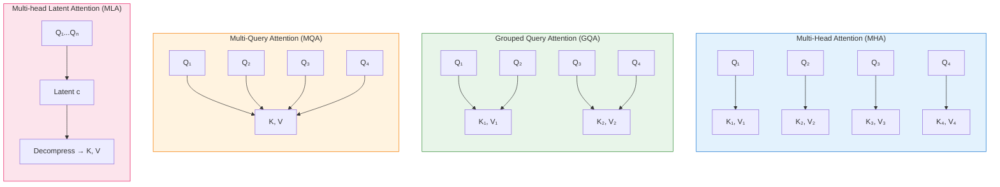
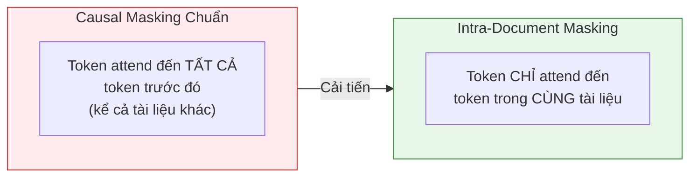
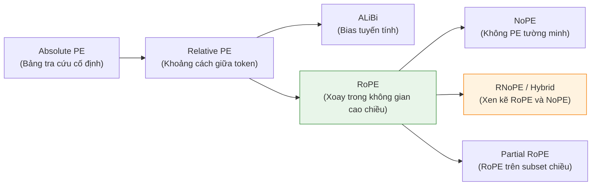
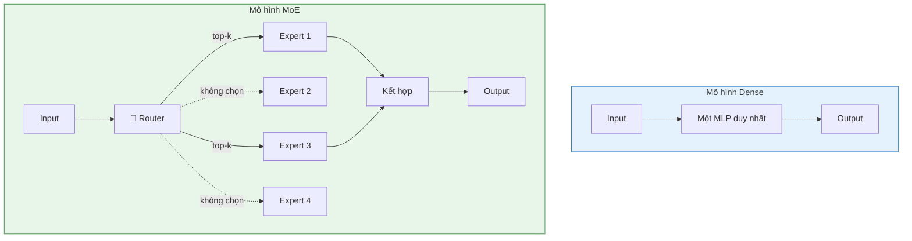

# Thiết kế Kiến trúc Mô hình

Bây giờ chúng ta đã có framework thí nghiệm, đã đến lúc đưa ra **những quyết định lớn** sẽ định nghĩa mô hình. Mỗi lựa chọn từ kích thước mô hình đến cơ chế attention đến tokenizer đều tạo ra ràng buộc và cơ hội ảnh hưởng đến quá trình huấn luyện và sử dụng mô hình.

Nhớ lại [la bàn huấn luyện](./la_ban_huan_luyen.md): Trước khi đưa ra bất kỳ lựa chọn kỹ thuật nào, chúng ta cần sự rõ ràng về *tại sao* và *cái gì*. Trả lời những câu hỏi này sớm giúp chúng ta quyết định cách cân bằng thời gian giữa công việc dữ liệu và kiến trúc.

Hãy dẫn bằng ví dụ — các mục tiêu hướng dẫn thiết kế SmolLM3:
- ✅ Mô hình mạnh cho **ứng dụng on-device** (trên thiết bị)
- ✅ Hiệu suất **đa ngôn ngữ** cạnh tranh
- ✅ Khả năng **toán và lập trình** vững chắc
- ✅ Xử lý **context dài** mạnh mẽ

Điều này dẫn chúng tôi đến **mô hình dense 3B tham số**: đủ lớn cho khả năng mạnh mẽ nhưng đủ nhỏ để chạy thoải mái trên điện thoại. Chúng tôi chọn dense transformer thay vì Mixture of Experts (MoE — Hỗn hợp Chuyên gia) hay hybrid, do ràng buộc bộ nhớ thiết bị biên và dòng thời gian dự án (~3 tháng).

---

## Bảng Lựa Chọn Kiến Trúc Các LLM Hàng Đầu

Nếu nhìn vào các mô hình gần đây như Qwen3, Gemma 3, hay DeepSeek-V3, bạn sẽ thấy dù khác nhau, tất cả đều chia sẻ cùng nền tảng: kiến trúc **Transformer** ra đời năm 2017. Cấu trúc cơ bản không thay đổi nhiều, nhưng đã có những cải tiến cho các thành phần cốt lõi.

| Mô hình | Loại | Attention | Pos. Encoding | LR Schedule | Optimizer |
|---------|------|-----------|---------------|-------------|-----------|
| Llama 3.1 | Dense | GQA | RoPE | Cosine | AdamW |
| Qwen3 | Dense | GQA | RoPE | WSD | AdamW |
| Gemma 3 | Dense | GQA + SWA | RoPE | Cosine | AdamW |
| DeepSeek-V3 | MoE | MLA | RoPE (partial) | Multi-step | AdamW |
| OLMo 2 | Dense | GQA | RoPE | WSD variant | AdamW |
| Kimi K2 | MoE | MLA | RoPE (partial) | Multi-step | Muon + Adam |
| SmolLM3 | Dense | GQA | RoPE + NoPE | Cosine | AdamW |
| Falcon-H1 | Hybrid | GQA + Mamba-2 | RoPE | WSD | AdamW |

> Nếu chưa hiểu một số thuật ngữ như MLA, NoPE, hay WSD — đừng lo; chúng tôi sẽ giải thích từng cái trong phần này.

> [!TIP] 📚 Tham khảo thêm
> Sebastian Raschka có bài ["Big LLM Architecture Comparison"](https://sebastianraschka.com/blog/2025/the-big-llm-architecture-comparison.html) cho cái nhìn tổng quan tuyệt vời về kiến trúc LLM hiện đại.

---

## Attention (Cơ chế Chú ý)

Một trong những lĩnh vực nghiên cứu tích cực nhất là cơ chế attention. Trong khi feedforward layer (lớp truyền thẳng) chiếm ưu thế compute trong pretraining, **attention trở thành nút thắt chính khi suy luận** (đặc biệt với context dài), nơi nó đẩy chi phí compute và yêu cầu bộ nhớ GPU lên cao.

### MHA vs MQA vs GQA vs MLA



**Multi-Head Attention (MHA)** là cơ chế attention chuẩn gốc. Mỗi head có tập query, key, value riêng. Tại inference, các KV value cho token quá khứ được lưu trong **KV cache**. Khi context window tăng, cache này nhanh chóng trở thành nút thắt.

Ước tính kích thước KV cache $s_{KV}$ cho Llama 3 với MHA và sequence length 8,192:

$$s_{KV} = 2 \times n_{layers} \times n_{heads} \times d_{head} \times seq\_len \times bytes\_per\_param$$

Câu hỏi tự nhiên: *Chúng ta có thực sự cần KV value mới cho mỗi head không?* Có lẽ không:

- **MQA** (Multi-Query Attention): Chia sẻ KV value cho *tất cả* head → giảm KV cache $n_{heads}$ lần
- **GQA** (Grouped Query Attention): Chia sẻ KV value theo *nhóm* head → trung gian giữa MQA và MHA
- **MLA** (Multi-head Latent Attention): Lưu biến latent nhỏ, giải nén thành KV tại runtime → DeepSeek-V2/V3

### Kết Quả Ablation — GQA Thắng MHA

Ablation so sánh MHA, MQA, và 4 thiết lập GQA (tỷ lệ 2, 4, 8, 16) cho thấy:

- **MQA** và GQA với 16 nhóm (chỉ 1-2 KV head) **hiệu suất kém hơn đáng kể** so với MHA
- **GQA với 2, 4, và 8 nhóm** gần bằng hiệu suất MHA
- Kết quả nhất quán trên cả loss curve và đánh giá downstream

> **Kết luận:** GQA là thay thế vững chắc cho MHA — bảo toàn hiệu suất trong khi hiệu quả hơn khi suy luận. SmolLM3 sử dụng **GQA với 4 nhóm**.

---

## Document Masking (Che Tài Liệu)

Trong pretraining, chúng ta huấn luyện với sequence length cố định, nhưng tài liệu có chiều dài biến đổi. Thay vì padding, chúng ta dùng **packing**: trộn và nối tài liệu với token EOS (End of Sequence), rồi chia thành các chunk có kích thước cố định.

```
File 1: "Công thức granola bars..." (400 tokens) <EOS>
File 2: "def hello_world()..." (300 tokens) <EOS>
File 3: "Tác động biến đổi khí hậu..." (1000 tokens) <EOS>
File 4: "import numpy as np..." (3000 tokens) <EOS>
...

Sau khi nối và chia thành sequence 4k:
Sequence 1: [File 1] + [File 2] + [File 3] + [phần File 4]
Sequence 2: [phần còn lại File 4] + [File 5] + [File 6] + ...
```

Với causal masking chuẩn, token có thể attend đến *tất cả* token trước đó — kể cả từ tài liệu không liên quan. **Intra-document masking** (che nội tài liệu) giới hạn attention chỉ trong cùng một tài liệu:



> Hơn **80% tài liệu** trong FineWeb-Edu, DCLM, FineMath, và Python-Edu chứa ít hơn 2k token. Với sequence 4k và causal masking chuẩn, phần lớn token lãng phí compute attend vào tài liệu không liên quan.

**Kết quả ablation:** Document masking cho kết quả tương đương trên short context nhưng **trở nên then chốt khi mở rộng sang sequence dài**. SmolLM3 áp dụng nó xuyên suốt toàn bộ quá trình huấn luyện.

Để bật document masking trong Nanotron:

```diff
model_config:
  _attn_implementation: flash_attention_2
  _fused_rms_norm: true
  _fused_rotary_emb: true
- _use_doc_masking: false
+ _use_doc_masking: true
```

---

## Embedding Sharing (Chia Sẻ Embedding)

LLM có hai thành phần embedding:
- **Input embeddings**: bảng tra cứu token-to-vector (kích thước $V \times h$)
- **Output embeddings**: lớp tuyến tính cuối ánh xạ hidden state thành logits ($h \times V$)

Tổng cộng: $2 \times V \times h$ tham số embedding. Cho mô hình nhỏ, embeddings có thể chiếm **phần lớn** tổng tham số.

**Embedding sharing** (tái sử dụng input embeddings cho output) là tối ưu hóa tự nhiên cho mô hình nhỏ. Mô hình lớn thường không dùng vì embedding chiếm tỷ lệ nhỏ hơn (13% ở Llama 3.2 8B, chỉ 3% ở Llama 3.1 70B).

### Kết Quả Ablation

| Cấu hình | Tham số | Số lớp | Kết quả |
|-----------|---------|--------|---------|
| Tied embeddings (baseline) | 1.2B | 16 | ✅ Tốt nhất |
| Untied embeddings | 1.46B | 16 | Tương đương (nhưng thêm 18% tham số) |
| Untied embeddings, ít lớp | 1.2B | 12 | ❌ Kém nhất |

> **Kết luận:** Tăng **chiều sâu mô hình** mang lại lợi ích lớn hơn so với untied embeddings ở cùng ngân sách tham số. SmolLM3 giữ tied embeddings.

---

## Positional Encoding và Long Context

Transformer tự bản chất **không có cảm nhận về thứ tự từ** — chúng tiêu thụ toàn bộ sequence đồng thời qua attention song song. Không có thông tin vị trí, "Adam thắng Muon" trông giống "Muon thắng Adam" từ góc nhìn mô hình.

Giải pháp: **positional embeddings** (embedding vị trí) — mã hóa toán học cho mỗi token một "địa chỉ" duy nhất trong sequence.

### Sự Tiến Hóa



### RoPE: Vị Trí Như Phép Xoay

Ý tưởng cốt lõi của RoPE (Rotary Position Embeddings) là mã hóa thông tin vị trí dưới dạng **góc xoay trong không gian nhiều chiều**. Thay vì cộng vector vị trí vào token embeddings, RoPE xoay vector query và key theo góc phụ thuộc vào vị trí tuyệt đối của chúng.

Công thức cho góc xoay:

$$\theta_{p,k} = p \times base^{-k / (dim/2)}$$

Trong đó:
- $p$ = vị trí token trong sequence
- $k$ = chỉ số cặp chiều
- $base$ = tần số cơ sở (thường 10,000)

```python
import torch

def apply_rope_simplified(x, pos, dim=64, base=10000):
    """
    Rotary Positional Embedding (RoPE)
    - Mỗi cặp chiều [x[2k], x[2k+1]] được xoay một góc θ_{p,k}
    - k nhỏ → dao động chậm → nắm bắt thông tin tầm xa
    - k lớn → dao động nhanh → nắm bắt chi tiết
    """
    rotated = []
    for i in range(0, dim, 2):
        k = i // 2
        inv_freq = 1.0 / (base ** (k / (dim // 2)))
        theta = pos * inv_freq
        cos_t = torch.cos(torch.tensor(theta, dtype=x.dtype))
        sin_t = torch.sin(torch.tensor(theta, dtype=x.dtype))
        x1, x2 = x[i], x[i+1]
        # Xoay 2D
        rotated.extend([
            x1 * cos_t - x2 * sin_t,
            x1 * sin_t + x2 * cos_t
        ])
    return torch.stack(rotated)
```

Khi hai token tương tác qua attention, dot product giữa các biểu diễn đã xoay mã hóa trực tiếp **khoảng cách tương đối** qua hiệu pha:

$$\text{dot\_product}(\text{RoPE}(x, m), \text{RoPE}(y, n)) = \sum_k [x_k \cdot y_k \cdot \cos((m-n) \cdot \theta_k)]$$

### Cấu hình Tần Số RoPE Cho Context Dài

Khi sequence dài hơn, góc xoay tăng lên, gây ra suy giảm attention score quá nhanh cho token xa. Giải pháp:

- **RoPE ABF** (Adjusted Base Frequency): Tăng tần số cơ sở khi tăng sequence length
- **YaRN** (Yet another RoPE extensioN): Nội suy tần số không đồng đều qua các chiều RoPE — tinh vi hơn ABF, hiệu suất thực nghiệm tốt hơn cho context cực dài

> Ví dụ: Qwen3 tăng tần số từ 10k lên 1M bằng ABF khi mở rộng từ 4k lên 32k context, sau đó áp dụng YaRN để đạt 131k (ngoại suy 4×).

### Phương Pháp Lai: NoPE và RNoPE

**NoPE** (No Positional Embedding) huấn luyện transformer hoàn toàn không có PE tường minh, cho phép mô hình ngầm học thông tin vị trí qua causal masking. Ưu điểm: tổng quát hóa chiều dài tốt hơn. Nhược điểm: hiệu suất yếu hơn trên short context.

**RNoPE** (kết hợp RoPE + NoPE) xen kẽ giữa lớp RoPE và lớp NoPE:
- Lớp RoPE: cung cấp thông tin vị trí tường minh, xử lý context cục bộ
- Lớp NoPE: cải thiện truy xuất thông tin ở khoảng cách xa

> Được sử dụng trong **Llama 4**, **Command A**, và **SmolLM3**.

**Ablation NoPE:** So sánh RoPE thuần vs NoPE (bỏ PE mỗi lớp thứ 4) vs NoPE + document masking cho thấy hiệu suất tương tự trên short context, đồng thời cung cấp nền tảng cho xử lý long context tốt hơn. SmolLM3 áp dụng **NoPE + document masking**.

### Giới Hạn Phạm Vi Attention Cho Context Dài

Ngoài điều chỉnh PE, một chiến lược bổ sung: **giới hạn token nào attend vào nhau**:

| Phương pháp | Mô tả | Sử dụng bởi |
|-------------|-------|------------|
| **Chunked Attention** | Chia sequence thành chunk cố định, attention chỉ trong chunk | Llama 4 |
| **Sliding Window (SWA)** | Mỗi token attend đến N token gần nhất | Mistral 7B, Gemma 3 |
| **Dual Chunk Attention** | Mở rộng chunked với luồng thông tin xuyên chunk | Qwen2.5 |
| **Attention Sinks** | Giữ KV cache của token đầu + sliding window gần | gpt-oss |

---

## Cải Thiện Tính Ổn Định

Các kỹ thuật giúp giảm bất ổn trong huấn luyện:

### Z-loss

Z-loss ngăn logits đầu ra tăng quá lớn bằng cách thêm penalty term. Ablation cho thấy Z-loss **không ảnh hưởng** đến loss hoặc hiệu suất downstream. SmolLM3 không sử dụng do overhead khi triển khai.

### Loại Bỏ Weight Decay Từ Embeddings

Weight decay trên embeddings khiến norm embedding giảm dần, dẫn đến gradient lớn hơn ở lớp đầu. **OLMo 2** phát hiện loại bỏ weight decay từ embeddings cải thiện ổn định. Ablation xác nhận không ảnh hưởng hiệu suất → SmolLM3 áp dụng.

### QK-norm

QK-norm áp dụng layer normalization lên vector query và key trước khi tính attention. Giúp ngăn attention logits quá lớn, nhưng **làm giảm hiệu suất long context** vì loại bỏ thông tin magnitude. SmolLM3 **không dùng** QK-norm.

---

## Going Sparse: MoE (Hỗn Hợp Chuyên Gia)

Trực giác: chúng ta không cần toàn bộ mô hình cho mỗi dự đoán token, tương tự cách não bộ kích hoạt các vùng khác nhau tùy nhiệm vụ.



**Mục tiêu MoE:** Tăng tổng tham số mà **không tăng tham số "hoạt động"** cho mỗi token. Tổng tham số ảnh hưởng đến tổng khả năng học, trong khi tham số hoạt động xác định chi phí huấn luyện và tốc độ suy luận.

Các khía cạnh thiết kế MoE:
- **Sparsity/Activation Ratio:** Nhiều sparsity hơn → hiệu quả FLOPs tốt hơn → giảm dần ở sparsity rất cao
- **Granularity:** Nhiều expert nhỏ vs ít expert lớn — xu hướng đi về granularity cao hơn
- **Shared Experts:** Expert "luôn bật" hấp thụ mẫu hình cơ bản — thường **1 shared expert** là đủ
- **Load Balancing:** Then chốt — nếu thiết lập kém, phá hoại mọi lựa chọn thiết kế khác

---

## Excursion: Mô Hình Hybrid

Xu hướng gần đây: bổ sung transformer bằng **state space models (SSM)** hoặc **linear attention**. Các mô hình này cố gắng giải quyết điểm yếu cơ bản của transformer trong xử lý context rất dài hiệu quả.

**Ý tưởng cốt lõi linear attention:** Sắp xếp lại phép tính để attention không còn tốn $O(n^2d)$:

- Dạng gốc: $\sum_{j\le t}(q_t^\top k_j)v_j$ → chi phí $O(td)$ tại bước $t$
- Dạng sắp xếp lại: $(\sum_{j\le t} v_j k_j^\top) q_t$ → duy trì ma trận state $S_t$ → chi phí $O(d^2)$ mỗi bước

Sinh $T$ token: gốc $O(T^2 d)$ vs state $O(Td^2)$ — đánh đổi phụ thuộc sequence length lấy phụ thuộc dimension.

Các biến thể đáng chú ý:
- **Lightning Attention**: Nhanh và hiệu quả, thay softmax bằng norm-based scaling
- **Mamba-2**: Dùng trong Nemotron-H, Falcon H1, Granite-4.0-h
- **Gated DeltaNet**: Dùng trong Qwen3-Next

> [!WARNING] ⚠️ Thực tế sản xuất
> MiniMax-M2 quyết định **không dùng** hybrid/linear attention mặc dù kết quả sớm hứa hẹn. Ở quy mô lớn, họ phát hiện "thiếu hụt rõ ràng trong các nhiệm vụ suy luận phức tạp, đa bước." Điều này cho thấy khoảng cách giữa nghiên cứu và thực tế sản xuất.

### Chọn Kiến Trúc Cơ Sở: Dense vs MoE vs Hybrid

| | Dense | MoE | Hybrid |
|---|-------|-----|--------|
| **Ưu điểm** | Hỗ trợ rộng rãi; ổn định; dễ hiểu | Hiệu suất/compute tốt hơn | Long context hiệu quả hơn |
| **Nhược điểm** | Compute tỷ lệ tuyến tính với kích thước | Bộ nhớ cao (tải tất cả expert); phức tạp hơn | Ít trưởng thành; ít recipe đã chứng minh |
| **Khi nào dùng** | Ràng buộc bộ nhớ; team mới | Không ràng buộc bộ nhớ; muốn tối đa hiệu suất/compute | Context rất dài; giảm overhead suy luận |

---

## Tokenizer

Tokenizer (bộ phân tích từ vựng) — thành phần có lẽ **bị đánh giá thấp nhất** trong bất kỳ mô hình ngôn ngữ nào. Nó là "thông dịch viên" giữa ngôn ngữ con người và thế giới toán học mà mô hình sống trong.

### Câu Hỏi Cơ Bản

Trước khi thiết kế tokenizer:
1. **Ngôn ngữ nào muốn hỗ trợ?** Tokenizer chỉ thấy tiếng Anh sẽ kém hiệu quả với văn bản không phải tiếng Anh
2. **Domain nào quan trọng?** Toán và code cần biểu diễn cẩn thận các chữ số
3. **Hỗn hợp dữ liệu mục tiêu là gì?** Huấn luyện tokenizer trên mẫu phản ánh hỗn hợp cuối cùng

### Kích Thước Từ Vựng

| Trường hợp | Kích thước đề xuất |
|------------|-------------------|
| Chỉ tiếng Anh | ~50k |
| Đa ngôn ngữ | 100k+ |
| SOTA hiện đại (Llama 3) | 128k+ |

> 💡 **Mẹo:** Đặt kích thước từ vựng là **bội số của 128** (ví dụ 50,304 thay vì 50,000) để tối ưu throughput — GPU hiện đại xử lý ma trận tốt hơn khi chiều chia hết cho lũy thừa cao của 2.

### Đo Chất Lượng Tokenizer

Hai metric chính từ FineWeb2:

- **Fertility** (Độ phì nhiêu): Số token trung bình cần để mã hóa một từ — **thấp hơn = tốt hơn**
- **Proportion of Continued Words (PCW)**: Phần trăm từ bị chia thành nhiều phần — **thấp hơn = tốt hơn**

```python
import numpy as np

def compute_tokenizer_metrics(tokenizer, word_tokenizer, text):
    """
    Tính fertility và proportion of continued words.
    Returns:
        tuple: (fertility, proportion_continued_words)
        - fertility: token trung bình mỗi từ (thấp hơn = tốt hơn)
        - proportion_continued_words: % từ bị chia thành 2+ token
    """
    words = word_tokenizer.word_tokenize(text)
    tokens = tokenizer.batch_encode_plus(words, add_special_tokens=False)
    tokens_per_word = np.array(list(map(len, tokens["input_ids"])))
    fertility = np.mean(tokens_per_word).item()
    proportion_continued_words = (tokens_per_word >= 2).sum() / len(tokens_per_word)
    return fertility, proportion_continued_words
```

### So Sánh Tokenizer Hiện Đại

| Tokenizer | Tiếng Anh | Tiếng Trung | Tiếng Pháp | Tiếng Ả Rập |
|-----------|-----------|-------------|------------|-------------|
| **Llama3** (128k) | 1.48 | 1.60 | 1.73 | 2.35 |
| **Gemma3** (262k) | **1.41** | 1.47 | **1.56** | 2.25 |
| **Mistral Small** | 1.59 | 1.78 | 1.69 | **2.15** |
| **Qwen3** (152k) | 1.54 | **1.45** | 1.75 | 2.26 |

*Giá trị = fertility (token/từ), thấp hơn = tốt hơn*

### Chọn Tokenizer Có Sẵn vs Tự Huấn Luyện

- **Dùng tokenizer có sẵn** khi trường hợp sử dụng khớp với coverage ngôn ngữ/domain đã có. SmolLM3 chọn tokenizer Llama 3: cạnh tranh trên 6 ngôn ngữ mục tiêu với từ vựng 128k.
- **Tự huấn luyện** khi bạn huấn luyện cho ngôn ngữ ít tài nguyên hoặc có hỗn hợp dữ liệu độc đáo. Huấn luyện trên dataset gần với hỗn hợp cuối cùng.

---

## Lựa Chọn Kiến Trúc SmolLM3

Tổng hợp mọi thứ cho SmolLM3 — mỗi thay đổi được **xác nhận qua ablation** riêng lẻ:

| Lựa chọn | Chi tiết | Lý do |
|-----------|---------|-------|
| **Tokenizer** | Llama 3.2 (128k vocab) | Cân bằng tốt nhất cho 6 ngôn ngữ mục tiêu |
| **Attention** | GQA với 4 nhóm | Bằng MHA hiệu suất, hiệu quả KV cache hơn |
| **Positional Encoding** | NoPE mỗi lớp thứ 4 + RoPE | Cải thiện long context, giữ short context |
| **Document Masking** | Intra-document attention | Tốc độ + ổn định cho sequence dài |
| **Layout** | Qwen2.5-3B (sâu hơn) | Sâu hơn giúp generalization |
| **Embeddings** | Tied embeddings | 18% ít tham số, hiệu suất tương đương |
| **Stability** | Bỏ weight decay từ embeddings | Giảm norm embedding, ngăn divergence |

> **Thứ tự kiểm tra:** tied embeddings → GQA → document masking → NoPE → bỏ weight decay.

---

## Quy Tắc Tham Gia

**TL;DR: Trường hợp sử dụng của bạn chi phối lựa chọn.**

1. **Để mục tiêu triển khai hướng dẫn quyết định kiến trúc.** Xem xét mô hình thực sự sẽ chạy ở đâu và như thế nào.

2. **Cân bằng đúng giữa đổi mới và thực dụng.** Không thể bỏ qua tiến bộ kiến trúc lớn — dùng MHA khi GQA tốt hơn là lựa chọn kỹ thuật tồi. Nhưng chống lại cám dỗ đuổi theo mỗi bài báo mới hứa hẹn cải thiện biên.

3. **Hệ thống thắng trực giác.** Xác nhận mọi thay đổi kiến trúc, dù nó trông hứa hẹn trên giấy đến đâu.

4. **Hiệu ứng quy mô là thực — re-ablate ở kích thước mục tiêu khi có thể.** Đừng giả định ablation quy mô nhỏ sẽ giữ hoàn hảo ở kích thước mô hình mục tiêu.

5. **Xác nhận hiệu quả tokenizer trên domain thực tế.** Metric fertility trên ngôn ngữ và domain mục tiêu quan trọng hơn việc theo dõi mô hình mới nhất dùng gì.
