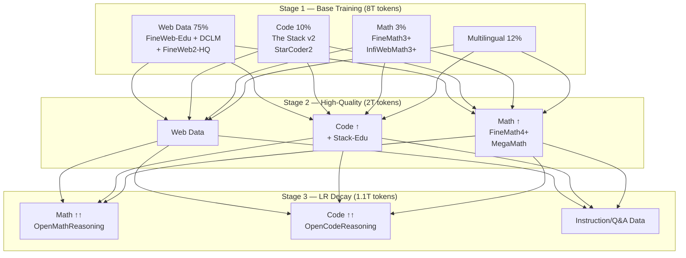

# Nghệ thuật Xử lý Dữ liệu (Data Curation)

Hãy tưởng tượng: Bạn đã dành hàng tuần hoàn thiện kiến trúc, tinh chỉnh siêu tham số và thiết lập hạ tầng huấn luyện vững chắc nhất. Mô hình hội tụ đẹp đẽ, và rồi... nó không thể viết code mạch lạc, chật vật với toán cơ bản, và thậm chí chuyển ngôn ngữ giữa câu. Chuyện gì đã xảy ra?

Câu trả lời thường nằm ở **dữ liệu**. Trong khi chúng ta ám ảnh với các đổi mới kiến trúc hào nhoáng và hyperparameter sweep, data curation (xử lý dữ liệu) thường quyết định liệu mô hình trở nên thực sự hữu ích hay chỉ là một thí nghiệm đắt tiền khác.

> Nếu kiến trúc mô hình định nghĩa **cách** mô hình học, thì dữ liệu định nghĩa **cái gì** nó học — và không có lượng compute hay tinh chỉnh optimizer nào có thể bù đắp cho việc huấn luyện trên nội dung sai.

## Tổng quan: Sự quan trọng của Data Mixture

Chúng ta kỳ vọng rất nhiều từ mô hình ngôn ngữ: viết code, đưa lời khuyên, trả lời câu hỏi về mọi thứ, hoàn thành tác vụ bằng công cụ... Các nguồn pretraining (tiền huấn luyện) dồi dào như web không bao phủ đầy đủ phạm vi kiến thức và khả năng cần thiết. Do đó, các mô hình gần đây bổ sung các tập dữ liệu chuyên biệt cho toán, code, v.v.

### Bản chất phản trực giác của Data Mixtures

Nếu bạn mới huấn luyện mô hình ngôn ngữ, tìm data mixture (tỷ lệ dữ liệu) tốt có vẻ đơn giản: xác định mục tiêu, thu thập dataset chất lượng cho từng domain, kết hợp chúng. Thực tế phức tạp hơn nhiều:

- **Các domain cạnh tranh nhau**: Tăng trọng số cho coding ngầm giảm trọng số mọi nguồn khác, có thể làm hại khả năng ở lĩnh vực khác
- **Không thể chỉ dùng data chất lượng cao nhất**: Với ngân sách huấn luyện lớn như 11T token của SmolLM3, lọc cực đoan sẽ dẫn đến lặp lại dữ liệu nhiều lần — điều đã được chứng minh gây hại (Muennighoff et al., 2025)
- **Mixture không cần cố định**: Điều chỉnh mixture theo tiến trình huấn luyện — gọi là **multi-stage** hoặc **curriculum training** — giúp tận dụng tốt hơn cả data chất lượng cao và thấp

### Sự tiến hóa của Training Curricula

Trong những ngày đầu, mô hình như GPT-3 huấn luyện trên mixture cố định từ đầu đến cuối. Gần đây, lĩnh vực chuyển sang cách tiếp cận **đa giai đoạn**: mixture thay đổi trong quá trình huấn luyện.

Động lực chính: **hành vi cuối cùng của mô hình chịu ảnh hưởng mạnh bởi dữ liệu nhìn thấy cuối huấn luyện** (Y. Chen et al., 2025b). Điều này tạo chiến lược thực tế: tăng trọng số nguồn phong phú sớm, trộn nguồn chất lượng cao hơn nhưng nhỏ hơn vào cuối.

## English Web Data: Tầng nền tảng

Văn bản web tạo xương sống cho mọi LLM đa dụng, nhưng **chất lượng quan trọng ngang số lượng**.

### Pipeline FineWeb

Từ SmolLM2, **FineWeb-Edu** và **DCLM** được xác định là hai tập web tiếng Anh mở mạnh nhất. Cùng nhau, chúng cho **5.1T token** web tiếng Anh chất lượng cao.

Thách thức là xác định tỷ lệ trộn tối ưu:
- **FineWeb-Edu**: Giúp benchmark giáo dục và STEM
- **DCLM**: Cải thiện common-sense reasoning (suy luận thường thức)

SmolLM3 chạy sweep trên mô hình 3B qua 100B token, thử tỷ lệ FineWeb-Edu/DCLM: 20/80, 40/60, 50/50, 60/40, 80/20. Kết quả: trộn **50/50** hoặc **60/40** cho cân bằng tốt nhất trên các benchmark. Chọn 50/50 cho stage 1.

Bổ sung thêm: pes2o, Wikipedia & Wikibooks, StackExchange — không tác động hiệu suất nhưng cải thiện đa dạng.

## Code Data: The Stack v2

Nguồn code cho stage 1 trích từ StarCoder2 và The Stack v2:

| Nguồn | Mục đích |
|-------|----------|
| **The Stack v2** (16 ngôn ngữ) | Cơ sở, lọc theo StarCoder2Data |
| **GitHub pull requests** | Suy luận review code thực tế |
| **Jupyter & Kaggle notebooks** | Workflow thực thi từng bước |
| **GitHub issues & Stack Exchange** | Thảo luận ngữ cảnh xung quanh code |

Aryabumi et al. (2024) chỉ ra rằng code cải thiện hiệu suất mô hình ngôn ngữ **vượt xa lĩnh vực coding** — ví dụ suy luận ngôn ngữ tự nhiên và kiến thức thế giới — và đề xuất **25% code** trong mixture. Tuy nhiên, SmolLM3 quan sát **suy giảm đáng kể trên benchmark tiếng Anh** (HellaSwag, ARC-C, MMLU) ở 25%. Giảm xuống **10% code** không thấy cải thiện trên bộ benchmark so với 0% code, nhưng vẫn bao gồm vì code generation là khả năng rất quan trọng.

**Stack-Edu** — tập con được lọc theo tính giáo dục — được trì hoãn đến giai đoạn sau, theo nguyên tắc staging data chất lượng cao cho tác động tối đa cuối huấn luyện.

## Math Data: FineMath, OpenWebMath

Triết lý tương tự code. Giai đoạn đầu dùng tập lớn hơn, tổng quát hơn: **FineMath3+** và **InfiWebMath3+**. Sau đó tăng trọng số FineMath4+ và InfiWebMath4+ và giới thiệu dataset mới chất lượng cao:

- **MegaMath** (Zhou et al., 2025)
- **OpenMathInstruct** (Toshniwal et al., 2024) — instruction dataset
- **OpenMathReasoning** (Moshkov et al., 2025) — reasoning dataset

Stage 1 dùng **3% math**, chia đều giữa FineMath3+ và InfiWebMath3+. Với chỉ 54B token có sẵn và stage 1 ước tính 8T–9T token, dùng nhiều hơn sẽ phải lặp hơn 5 epoch trên dataset.

## Dữ liệu Đa ngôn ngữ (Multilingual Data)

### Thách thức

Câu hỏi chính: **Bao nhiêu phần trăm web data nên là không phải tiếng Anh?** Càng nhiều dữ liệu mô hình thấy ở một ngôn ngữ, nó càng giỏi ngôn ngữ đó. Tuy nhiên, ngân sách compute cố định nghĩa là tăng cho một ngôn ngữ đồng nghĩa giảm cho ngôn ngữ khác, kể cả tiếng Anh.

### Nguồn và Lựa chọn

SmolLM3 nhắm **5 ngôn ngữ chính**: Pháp, Tây Ban Nha, Đức, Ý, Bồ Đào Nha — chọn từ **FineWeb2-HQ**, tổng cộng **628B token**. Thêm 10 ngôn ngữ khác ở tỷ lệ nhỏ (Trung, Ả Rập, Nga...) — không nhằm đạt hiệu suất SOTA mà để cho phép continual pretraining dễ dàng.

### Kết quả Ablation

Qua ablation trên mô hình 3B: **12% nội dung đa ngôn ngữ** (khoảng 14% web mix tổng thể) đạt cân bằng đúng — cải thiện hiệu suất đa ngôn ngữ mà không làm giảm benchmark tiếng Anh. Với chỉ 628B token không-tiếng-Anh so với 5.1T token tiếng Anh, tăng cao hơn nhiều sẽ đòi hỏi lặp lại nhiều dữ liệu đa ngôn ngữ.

## Chiến lược Data Mixing

## Ablation Setup: Cách kiểm tra Data Recipes một cách hệ thống

Khi kiểm tra data mixtures, cách tiếp cận tương tự ablation kiến trúc nhưng với một khác biệt: **cố gắng chạy ở quy mô mô hình mục tiêu**. Mô hình nhỏ và lớn có dung lượng khác nhau — ví dụ mô hình rất nhỏ có thể chật vật với nhiều ngôn ngữ, trong khi mô hình lớn hơn xử lý tốt mà không hy sinh hiệu suất ở nơi khác. Do đó, chạy data ablation ở quy mô quá nhỏ có nguy cơ rút ra kết luận sai.

### Phương pháp SmolLM3

SmolLM3 chạy data ablation chính trực tiếp trên **mô hình 3B**, dùng huấn luyện ngắn **50B và 100B token**. Cũng sử dụng kiểu ablation khác: **annealing experiments** (thí nghiệm ủ nhiệt). Thay vì huấn luyện từ đầu với mixture khác nhau, lấy checkpoint trung gian từ lần chạy chính (ví dụ ở 7T token) và tiếp tục huấn luyện với thành phần dữ liệu đã sửa đổi.

Ví dụ, để kiểm tra MegaMath có cải thiện hiệu suất toán không:
- **40% baseline mixture**: Mixture stage 1 chính xác đang huấn luyện
- **60% dataset mới**: MegaMath cần đánh giá

### Phương pháp tự động (và giới hạn)

Các phương pháp tự động để tìm tỷ lệ dữ liệu tối ưu:

| Phương pháp | Mô tả |
|-------------|-------|
| **DoReMi** (Xie et al., 2023) | Dùng proxy model nhỏ để học domain weights tối thiểu hóa validation loss |
| **RHO-LOSS** (Mindermann et al., 2022) | Chọn training points dựa trên holdout loss, ưu tiên mẫu learnable và task-relevant |
| **RegMix** (Q. Liu et al., 2025) | Xác định tỷ lệ tối ưu qua regularized regression cân bằng hiệu suất |

SmolLM3 đã thử nghiệm DoReMi và RHO-LOSS nhưng phát hiện chúng có xu hướng hội tụ về phân phối phản ánh phân phối tự nhiên của kích thước dataset — về cơ bản gợi ý dùng nhiều hơn cái mà đã có nhiều. Các mô hình SOTA gần đây vẫn dựa vào **tinh chỉnh mixture thủ công** qua ablation hệ thống và thí nghiệm annealing.

## SmolLM3: Xử lý Data Mixture

SmolLM3 muốn mô hình xử lý tốt nội dung tiếng Anh và đa ngôn ngữ, xuất sắc ở toán và code. Quy trình:

1. **Xây trên nền tảng đã chứng minh**: SmolLM2 đã thiết lập recipe mạnh ở 1.7B cho web tiếng Anh và xác định dataset toán/code tốt nhất. Mục tiêu: mở rộng thành công đó lên 3B tham số, thêm đa ngôn ngữ, toán mạnh hơn, code tốt hơn.

2. **Ablation hệ thống** trên mô hình 3B để tìm tỷ lệ tối ưu cho từng domain.

3. **Multi-stage training** để tận dụng tối đa data chất lượng cao.

## Annealing và Cooldown Data

Mixture không cần cố định suốt quá trình huấn luyện. **Multi-stage training** cho phép dịch chuyển tỷ lệ dataset theo chiến lược:

**Thay đổi có kế hoạch**: SmolLM3 biết sẽ giới thiệu FineMath4+ và Stack-Edu chất lượng cao hơn ở stage 2, rồi thêm Q&A và reasoning data trong giai đoạn decay cuối.

**Thay đổi phản ứng**: Được thúc đẩy bởi giám sát hiệu suất. Ví dụ trong SmolLM2, khi phát hiện hiệu suất toán và code tụt hậu, đã tạo dataset hoàn toàn mới (FineMath và Stack-Edu) và giới thiệu giữa huấn luyện.

### Khi nào thay đổi mixture?

Không có quy tắc phổ quát, nhưng thường theo các nguyên tắc:

1. **Can thiệp dựa trên hiệu suất**: Giám sát metric đánh giá trên benchmark chính và điều chỉnh mixture để giải quyết bottleneck cụ thể
2. **Dành data chất lượng cao cho giai đoạn muộn**: Dataset toán và code nhỏ, chất lượng cao có tác động lớn nhất khi giới thiệu cuối huấn luyện
3. **Tăng dần chất lượng**: Bắt đầu với data dồi dào hơn, tổng quát hơn; kết thúc với data được chọn lọc kỹ

## Quy tắc Thực hành

> [!IMPORTANT]
> **Nguyên tắc cốt lõi:** Data curation thường mang lại lợi ích hiệu suất lớn nhất — lớn hơn cả đổi mới kiến trúc hay tinh chỉnh optimizer.

- **Mixture phụ thuộc vào mô hình**: Tỷ lệ tối ưu cho 1B không nhất thiết tối ưu cho 3B. Chạy data ablation ở quy mô mục tiêu khi có thể.

- **Ablation quan trọng hơn trực giác**: Trade-off giữa các domain phản trực giác — tăng code có thể giảm suy luận tiếng Anh. Chỉ có ablation mới cho câu trả lời chắc chắn.

- **Đừng bỏ qua data đa dạng**: Ngay cả khi một số nguồn không cải thiện benchmark trực tiếp, chúng cải thiện tính đa dạng và mạnh mẽ (robustness) tổng thể.

- **Tận dụng annealing experiments**: Thay vì huấn luyện từ đầu cho mỗi mixture mới, lấy checkpoint trung gian và annealing — tiết kiệm compute đáng kể.

- **Lặp lại dữ liệu có hại**: Khi data chất lượng cao khan hiếm, thà dùng data chất lượng thấp hơn một chút còn hơn lặp lại quá nhiều epoch trên cùng một dataset.
